import { Aside } from 'astro-pure/user'
import { LinkPreview } from 'astro-pure/advanced'

## 前言
### 关于本篇文章
本篇文章并非优秀的mc插件编写教程，比起教程，更像是我学习插件编写的笔记。由于我自身水平有限，文章内容难免出现问题，如果读者对文章内容有疑问或者建议，可以通过邮箱或者其它方式联系我，我在此感激不尽！

本篇文章虽然以[paper](https://papermc.io/)为例，但是文章的大部分内容还是有关[bukkit API](https://hub.spigotmc.org/javadocs/spigot/)的，因此本篇文章也可作为[spigot](https://www.spigotmc.org/)插件甚至是原生的[bukkit](https://dev.bukkit.org/)插件的教程。

### 关于bukkit和bukkit API
[bukkit](https://dev.bukkit.org/)是一款免费、开源的软件，旨在为minecraft服务器提供拓展的方法。

bukkit修改了minecraft的底层代码，在代码中添加了许多的钩子（hook），提供了丰富的[bukkit API](https://hub.spigotmc.org/javadocs/spigot/)，让开发者能够制作各种各样的插件（plugin），从而拓展minecraft游戏内容。

### 关于paper
对于minecraft服务器，使用原生的bukkit并不是一个好的选择，大多数minecraft服务器选择使用bukkit的分支[spigot](https://www.spigotmc.org/)的分支[paper](https://papermc.io/)（对，就是bukkit的分支的分支）。幸运的是，spigot与paper几乎完美地兼容了bukkit插件。

### 开发环境
为了方便开发，本篇文章所使用的开发的游戏环境为paper-1.21.4，开发工具是[IntelliJ IDEA](https://www.jetbrains.com/idea/)和IntelliJ IDEA的插件[Minecraft Development](https://plugins.jetbrains.com/plugin/8327-minecraft-development)（这个真的强力推荐）。

### 关于本文档的示例插件
项目文件已上传至[github](https://github.com/FutabaTachibana/paperdemo)。因为使用到了Paper独有的内容（该部分会特别说明），所以该插件仅能在Paper上运行。

## 第一个paper项目
根据[paper官方文档](https://docs.papermc.io/paper/dev/project-setup)，我们尝试创建一个paper项目。

### 创建paper项目
打开IntelliJ IDEA，点击`新建项目`，然后找到一个名为`minecraft`的`生成器`，项目名称填写对应的项目名称，例如`paperdemo`。其它选项依次如下设置。

1. `Groups`：选择`Plugin`（其它选项依次是模组、代理端插件）。
2. `Templates`：选择`Paper`（选择其它项应该也是可以的）。
3. `构建系统`：推荐选择`Gradle`。
4. `Language`：选择`Java`。
5. `Minecraft版本`：按实际开发需求进行选择，一般而言，bukkit插件对版本的判定极为宽松，旧版本的插件可能仍然能在新版本中运行。
6. `Plugin名称`：按实际情况填写，推荐与项目一致。
7. `主类`：带上包名。包名的前面部分通常是一个域名的转置，例如`net.minecraft`。Java不会判断你是否拥有这个域名，因此你可以填写`com.example.paperdemo.Paperdemo`，但请注意不要填写`net.minecraft`、`org.bukkit`等你可能会使用的名称作为域名部分。
8. `许可证`：软件的许可证，例如 *MIT*、*GPL 3.0*等，根据自己实际需要选择。示例项目不需要考虑特别多，随便选一个就行。
9. 其它选项依据自身情况填写。

之后，点击`创建`后稍等片刻即可创建项目。

### 项目结构
如果你的构建系统使用的是`gradle`，那么你的paper项目结构会是这样的（假如你构建过了，或者创建了git仓库，可能会有其它文件）。

在这里我的插件所使用的包名是`top.tachibana.paperdemo`，这是一个真实存在的域名（是我的）。如果你没有自己的域名，可以使用`com.example.paperdemo`。

```directory
paperdemo
├── build.gradle.kts
├── settings.gradle.kts
├── src
    └── main
        ├── java
            └── top
                └── tachibana
                    ├── paperdemo
                        ├── Paperdemo.java
                        └── ...
                    └── ...
        └── resources
            └── plugin.yml
└── ...
```

我们将会把源文件放在`java`文件夹下，资源文件放在`resources`文件夹下。

值得注意的是，`Paperdemo.java`是主类。我们将会在这里定义一系列方法，它们决定了插件初始化或启用时的一些行为，或者是注册事件侦听器等重要的行为。

`plugin.yml`储存了关于插件的详细信息，我将在[下一节](#pluginyml)详细介绍`plugin.yml`。

### plugin.yml
`plugin.yml`的示例文件如下。

```yml
# at /src/main/resources/plugin.yml
name: paperdemo                              #插件的名字
version: '1.0-SNAPSHOT'                      #插件的版本
main: top.tachibana.paperdemo.Paperdemo      #插件的主类
api-version: '1.21.4'                        #API的版本，如果游戏版本低于API版本，插件将不会加载
description: An example paper plugin         #插件描述
author: Futaba_Tachibana                     #作者，也就是你啦
#authors: [Futaba_Tachibana, Dblv_Tangerine] #插件有多个作者时使用
website: https://syju.org                    #插件的网站，可以是宣传页面，也可以是github的项目网站
contributors: [PaperMC, SpigotMC, Bukkit]    #贡献者
prefix: DemoPlugin                           #插件的前缀，这将会显示在日志中
load: STARTUP                                #用来告诉服务器何时加载该插件，可以是STARTUP或POSTWORLD（默认值）
depend: [Vault, WorldEdit]                   #插件的依赖，当且仅当前置插件全部被找到时你的插件才能被加载
#                                            #如果不填写该字段的值你的插件随时都能加载
softdepend: [Vault, WorldEdit]               #软依赖，当服务器没有找到softdepend的插件时，你的插件也能被加载
loadbefore: [Vault, FactionsUUID]            #在加载这些插件之前应该先加载你的插件
provides: [Vault]                            #告诉服务器你能提供这个插件的功能
#                                            #假如另一个插件依赖vault，那么只需安装你的插件而不必要安装Vault
```

权限和命令也被定义在`plugin.yml`。例如，示例插件有两个权限节点，它们分别是`permission.node`和`another.permission.node`，`permission.node`默认情况下只有op才有，它有一个子节点`child`，而`another.permission.node`默认情况下非op玩家才有。那么我们应该这样填写配置文件。

```yml
# at /src/main/resources/plugin.yml
permissions :
  permission.node:
    description: "This is a permission node"
    default: op
    children:
      permission.node.child: true
  another.permission.node:
    description: "This is another permission node"
    default: not op
```

权限节点的值为`op`/`not op`或`true`/`false`。如果子节点被设置为`true`，那么它的实际值将继承自父节点。可以通过添加`default-permission: true`的赋值来将权限节点的默认值（用于那些未指定`default`值的权限节点）设置为`true`。

如果示例插件使用到了`/demo`（或者`/cmd`）命令，而这个命令需要拥有`permission.node`节点，那么我们可以这样填写配置文件。

```yml
# at /src/main/resources/plugin.yml
commands:
  demo:
    description: "一个示例指令"
    aliases: [cmd, command]
    usage: |
     实现一个指令，有print, suicide, spawn, msg四个子命令
     /demo print 打印插件的名字
     /demo suicide 杀死执行指令的玩家
     /demo spawn 召唤一头猪
     /demo msg join 输出\"xxx加入了游戏\"的消息
     /demo msg leave 输出\"xxx离开了游戏\"的消息
    permission: permission.node
    permission-message: "You do not have permission to use this command"
```

`permission-message`是该玩家没有权限时使用该命令的消息。如上，默认情况下，`/demo`命令只有op才能使用。

### 主类
在主类中，我们可以定义以下方法。
```java
// at /src/main/java/top/tachibana/paperdemo/Paperdemo.java
package top.tachibana.paperdemo;

import org.bukkit.plugin.java.JavaPlugin;

public final class Paperdemo extends JavaPlugin {
    @Override
    public void onLoad(){
        //当插件初始化时，下面的代码将被执行
    }
    @Override
    public void onEnable() {
        //当插件加载时，下面的代码将被执行
        //通常用这个方法来注册一系列内容
    }
    @Override
    public void onDisable() {
        //当插件被禁用时，下面的代码将被执行
    }
}
```

### 构建项目
在IntelliJ IDEA右上角找到编辑配置并点击。

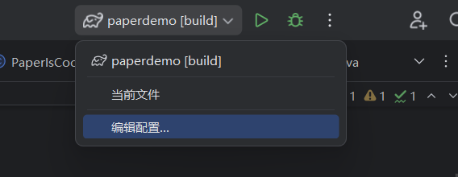

点击左上角的`+`并且点击`Gradle`。

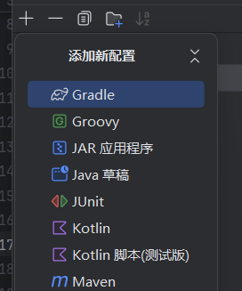

运行参数填写`build`，点击确定即可。之后只要点击右上角的绿色小三角或按住`shift+F10`即可构建项目。构建完后的可执行文件将会在路径`/build/libs/`下。

### 调试插件
将测试服务器的路径放到项目文件夹下，比方说你可以在项目文件夹下创建一个叫做`test`的文件夹，然后将服务器的所有文件都拖至该文件夹。

点击左上角的`+`之后在添加新配置中选择`JAR 应用程序`，配置按照下图填写。


之后选择该配置点击**调试**即可。

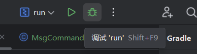

至此，调试环境已经搭建好了，你现在可以为你的插件打上断点了。

## 事件
在minecraft游戏进程中，每当游戏发生特定的事件（event），如玩家加入游戏、实体被杀死等等等等（它们分别会触发事件`org.bukkit.event.player.PlayerJoinEvent`和事件`org.bukkit.event.entity.EntityDeathEvent`）。我们可以通过创建事件监听器（Event Listener）来设计当特定的事件发生时，游戏的运行方式，这可以实现很多有意思的事情。

### 事件监听器
为了创建事件监听器，我们需要定义一个类，它实现了`org.bukkit.event.Listener`接口。

```java
// at /src/main/java/top/tachibana/paperdemo/PaperdemoListener.java
package top.tachibana.paperdemo;

import org.bukkit.event.EventHandler;
import org.bukkit.event.Listener;
import org.bukkit.event.player.PlayerBucketFillEvent;

public final class PaperdemoListener implements Listener {
    @EventHandler
    public void onBucket(PlayerBucketFillEvent event){
        //当事件PlayerBucketFillEvent触发时
        //这个方法的代码将会被执行
    }
}
```

我们在`/src/main/java/top/tachibana/paperdemo/`中新建了一个类`paperdemoListener`，它有一个名为`onBucket()`的方法，这个方法有注解`@EventHandler`，因此它是一个事件监听器。它的参数类型是`PlayerBucketFillEvent`，查阅bukkit API文档的[相关内容](https://hub.spigotmc.org/javadocs/bukkit/org/bukkit/event/player/PlayerBucketFillEvent.html)，我们可以找到关于这个事件的详细信息。例如，文档中是这样描述该事件的。

> Called when a player fills a bucket

因此我们了解到，当玩家使用桶装液体时，该事件会被触发。当事件触发时，方法`onBucket()`的代码将会被执行。

```java
// at /src/main/java/top/tachibana/paperdemo/PaperdemoListener.java
package top.tachibana.paperdemo;

import org.bukkit.event.EventHandler;
import org.bukkit.event.Listener;
import org.bukkit.event.player.PlayerBucketFillEvent;
import org.bukkit.inventory.ItemStack;
import org.bukkit.Material;

public final class PaperdemoListener implements Listener {
    @EventHandler
    public void onBucket(PlayerBucketFillEvent event){
        if(event.getBlock().getType() == Material.LAVA){
            ItemStack water_bucket = new ItemStack(Material.WATER_BUCKET);
            event.setItemStack(water_bucket);
        } else if (event.getBlock().getType() == Material.WATER) {
            ItemStack lava_bucket = new ItemStack(Material.LAVA_BUCKET);
            event.setItemStack(lava_bucket);
        }
    }
}
```

上述代码中，我调用了事件对象`event`的方法`getBlock()`和`setItemStack()`，前者获取了用桶互动的方块类型，后者设置了事件结束后玩家手上获取到的物品堆栈（ItemStack，物品堆栈即为“占用一个格子的物品组”，它的构造器接受的参数有Material的枚举常量和物品的数量，如果物品的数量未指定则为**1**），而正常情况下应该是对应液体的桶。在上例中，我做了一个这样的改变：如果玩家尝试用桶去装水，将会获得熔岩桶；如果玩家尝试用桶去装熔岩，将会获得水桶。

编写完事件监听器后，不要忘记注册事件监听器。

```java
// at /src/main/java/top/tachibana/paperdemo/Paperdemo.java
package top.tachibana.paperdemo;

import org.bukkit.plugin.java.JavaPlugin;

public final class Paperdemo extends JavaPlugin {
    @Override
    public void onEnable() {
        //注册事件
        this.getServer().getPluginManager().registerEvents(new PaperdemoListener(), this);
    }
}
```

还记得之前提到过的主类中重写的方法`onEnable()`吗，我们正是通过该方法来注册事件监听器。`registerEvents()`有两个参数，即我们创建事件监听器的类的引用，以及插件的主类的引用。

### 事件类型
**Bukkit API**提供了多样的事件类型，它们都在包`org.bukkit.event`下，我们查阅Bukkit API文档，可以看到有关此包的详细信息。

*Related Packages*的内容为：

| Package | Description |
| ------- | ----------- |
| org.bukkit | The root package of the Bukkit API, contains generalized API classes. |
| org.bukkit.event.block | Events relating to when a block is changed or interacts with the world. |
| org.bukkit.event.enchantment | Events triggered from an enchantment table. |
| org.bukkit.event.entity | Events relating to entities, excluding some directly referencing some more specific entity types. |
| org.bukkit.event.hanging | Events relating to entities that hang. |
| org.bukkit.event.inventory | Events relating to inventory manipulation. |
| org.bukkit.event.player | Events relating to players. |
| org.bukkit.event.raid | Events related to raids. |
| org.bukkit.event.server | Events relating to programmatic state changes on the server. |
| org.bukkit.event.vehicle | Events relating to vehicular entities. |
| org.bukkit.event.weather | Events relating to weather. |
| org.bukkit.event.world | Events triggered by various world states or changes. |

bukkit将游戏中的各种事件全部分进了`org.bukkit.event`的子包，如果我们想查找玩家扔出物品的事件，那么不难猜测，既然这个事件是与玩家有关的，它应该在`player`下被定义，我们点进`org.bukkit.event.player`，再用浏览器搜索关键词*drop*或者*throw*，便可找到这么一个类：`org.bukkit.event.player.PlayerDropItemEvent`，它的描述如下：

> Thrown when a player drops an item from their inventory

完美符合要求！再继续查阅，我们可以发现该类实现了一个`getItemDrop()`，可以用它来获取玩家丢弃的物品，它的返回值类型`Item`记录了掉落物（众所周知掉落物是实体，所以这个接口理所应当地继承自`Entity`，虽然其实是`Entity.Spigot`）。

于是，我们便可以编写对应的事件监听器了。

```java
// at /src/main/java/top/tachibana/paperdemo/PaperdemoListener.java
package top.tachibana.paperdemo;

import org.bukkit.event.EventHandler;
import org.bukkit.event.Listener;
import org.bukkit.event.player.PlayerBucketFillEvent;
import org.bukkit.event.player.PlayerDropItemEvent;
import org.bukkit.inventory.ItemStack;
import org.bukkit.Material;

public final class PaperdemoListener implements Listener {
    @EventHandler
    public void onBucket(PlayerBucketFillEvent event){
        if(event.getBlock().getType() == Material.LAVA){
            ItemStack water_bucket = new ItemStack(Material.WATER_BUCKET);
            event.setItemStack(water_bucket);
        } else if (event.getBlock().getType() == Material.WATER) {
            ItemStack lava_bucket = new ItemStack(Material.LAVA_BUCKET);
            event.setItemStack(lava_bucket);
        }
    }
    @EventHandler
    public void onDrop(PlayerDropItemEvent event){
        //事件触发时将会被执行。
        //尽情发挥你的想象力编写代码！
    }  
}
```

如上，我们编写了这个项目的第二个事件监听器。

<Aside type="caution">
不是所有的事件都能被监听，比如事件`org.bukkit.event.player.PlayerEvent`就不能被监听。在查阅文档时一定要注意这个事件的类有没有实现方法`getHandlerList()`，如果没有，那么它不能被监听。
</Aside>

### 自定义事件
通过新建一个继承抽象类`Event`的类，实现其中的一些方法，我们便可自定义自己的事件。下面的例子所展示的事件会在玩家切换快捷栏的槽位让钻石变成手持物品后触发。

```java
// at /src/main/java/top/tachibana/paperdemo/PlayerDiamondHeld.java
package top.tachibana.paperdemo;

import org.bukkit.entity.Player;
import org.bukkit.event.Event;
import org.bukkit.event.HandlerList;

public class PlayerDiamondHeld extends Event implements Cancellable {
    private final static HandlerList HANDLER_LIST = new HandlerList();
    private final Player player;
    // 构造器
    public PlayerDiamondHeld(Player who){
        this.player = who;
    }
    // 属性
    public Player getPlayer() {
        return player;
    }
    // 只有实现了方法getHandlerList()的事件才能被监听
    // 注意这个方法是静态的
    public static HandlerList getHandlerList(){
        return HANDLER_LIST;
    }
    // 注意这个方法是动态的
    @Override
    public HandlerList getHandlers(){
        return HANDLER_LIST;
    }
}
```

因为我们新建的类继承了抽象类`Event`，所以后续如果要实例化这个类的话，必须实现它的抽象方法`getHandlers()`。并且，如果你想让你的事件能被监听，还要实现**静态**方法`getHandlerList()`。

为了让我们的事件能被取消，我们还需实现接口`Cancellable`，并且实现它的全部方法。

```java
// at /src/main/java/top/tachibana/paperdemo/PlayerDiamondHeld.java
package top.tachibana.paperdemo;

import org.bukkit.entity.Player;
import org.bukkit.event.Cancellable;
import org.bukkit.event.Event;
import org.bukkit.event.HandlerList;

public class PlayerDiamondHeld extends Event implements Cancellable {
    private final static HandlerList HANDLER_LIST = new HandlerList();
    private final Player player;
    private boolean cancelled;
    // 构造器
    public PlayerDiamondHeld(Player who){
        this.player = who;
    }
    // 属性
    public Player getPlayer() {
        return player;
    }
    // 只有实现了方法getHandlerList()的事件才能被监听
    // 注意这个方法是静态的
    public static HandlerList getHandlerList(){
        return HANDLER_LIST;
    }
    // 注意这个方法是动态的
    @Override
    public HandlerList getHandlers(){
        return HANDLER_LIST;
    }
    // 为了实现Cancellable 需要定义下面的两个方法
    // cancelled的访问属性
    @Override
    public boolean isCancelled(){
        return this.cancelled;
    }
    // cancelled的修改属性
    @Override
    public void setCancelled(boolean cancelled){
        this.cancelled = cancelled;
    }
}
```

以上便是我们的自定义事件类的全部代码了。

我们还需要一个方法处理我们的事件。

```java
// at /src/main/java/top/tachibana/paperdemo/PaperdemoListener.java
package top.tachibana.paperdemo;

import org.bukkit.entity.Player;
import net.kyori.adventure.text.Component;
import net.kyori.adventure.text.format.NamedTextColor;
//import ...

public final class PaperdemoListener implements Listener {
    // ...
    public void callPlayerDiamondHeld(Player who){
        PlayerDiamondHeld event = new PlayerDiamondHeld(who);
        // call事件
        if(event.callEvent()) {
            event.getPlayer().sendMessage(Component.text("PlayerDiamondHeld事件被触发", NamedTextColor.YELLOW));
        }
        // 与下面的写法等价
//        event.callEvent();
//        if(!event.isCancelled()) {
//            event.getPlayer().sendMessage(Component.text("PlayerDiamondHeld事件被触发", NamedTextColor.YELLOW));
//        }
    }
    // ...
}
```

当方法被调用时，事件也会被触发。值得注意的是，事件将会在自定义类`PlayerDiamondHeld`的实例的成员方法`callEvent()`被调用时触发，此时对应的事件监听器也会在此刻运行，这个方法的返回值是事件是否被取消。

以上，我们便可以尝试编写我们自己的事件监听器，去监听我们自己的事件（~~别看有点绕，其实就是这样的~~）。

```java
// at /src/main/java/top/tachibana/paperdemo/PaperdemoListener.java
package top.tachibana.paperdemo;

import org.bukkit.entity.Player;
import net.kyori.adventure.text.Component;
import net.kyori.adventure.text.format.NamedTextColor;
import org.bukkit.event.EventHandler;
import org.bukkit.event.Listener;
import org.bukkit.inventory.ItemStack;
//import ...

public final class PaperdemoListener implements Listener {
    // ...
    // 我们的自定义事件可被监听 也可被取消
    @EventHandler
    public void onPlayerDiamondHeld(PlayerDiamondHeld event){
        ItemStack offHand = event.getPlayer().getInventory().getItemInOffHand();
        if(offHand.getType() == Material.NETHERITE_INGOT){
            Player player = event.getPlayer();
            player.sendMessage(Component.text("拿了钻石还拿下界合金锭？什么好事都让你占了。", NamedTextColor.RED));
            player.playSound(player, Sound.ENTITY_LIGHTNING_BOLT_THUNDER, 1, 1);
            event.setCancelled(true);
        }
    }
    // ...
}
```

注意`player`的成员方法`playSound()`，作用是播放声音，第一个参数可以是一个`Location`对象，也可以是一个`Entity`对象（表示该实体的位置），第二个参数是`Sound`的枚举常量，第三个参数是音量大小，类型是`float`，第四个参数表示音调的高低，类型也是`float`。

此外就是方法`getInventory()`，这个我将会在[物品栏](#%E7%89%A9%E5%93%81%E6%A0%8F)章节中讲述。

最后我们适时地触发这个事件。

```java
// at /src/main/java/top/tachibana/paperdemo/PaperdemoListener.java
package top.tachibana.paperdemo;

import org.bukkit.entity.Player;
import org.bukkit.event.EventHandler;
import org.bukkit.event.Listener;
import org.bukkit.inventory.ItemStack;
import org.bukkit.event.player.*;
//import ...

public final class PaperdemoListener implements Listener {
    // ...
    @EventHandler
    public  void onHeld(PlayerItemHeldEvent event){
        // 用于call我们的自定义事件
        ItemStack newItem = event.getPlayer().getInventory().getItem(event.getNewSlot());
        if(newItem != null && newItem.getType() == Material.DIAMOND){
            callPlayerDiamondHeld(event.getPlayer());
        }
    }
    // ...
}
```

这样，我们便可以让我们的事件能被触发。一般地，当玩家切换了快捷栏槽位后手持钻石，事件就会被触发，我们就能看到事件触发后输出的文字；若此时的副手若是下界合金锭，会触发事件监听器，随后事件会被事件监听器取消，我们也就看不到事件触发后输出的文字了。

## 指令

<Aside title='二编' type="danger">
这一节中内容是使用 Bukkit API 来实现指令的功能，对于1.21+且使用 Paper 开发的插件，建议使用 Mojang 开发的 [Brigadier API](https://github.com/Mojang/brigadier)，它是 Minecraft 的命令解析框架，能够更方便地实现复杂的指令逻辑。

对于 Brigadier API 的教程，可以看我的文章：
<LinkPreview href='https://syju.org/blog/brigadier/' />
</Aside>

还记得我们在`plugin.yml`定义的指令吗？

```yml
# at /src/main/resources/plugin.yml
commands:
  demo:
    description: "一个示例指令"
    aliases: [cmd, command]
    usage: |
     实现一个指令，有print, suicide, spawn, msg四个子命令
     /demo print 打印插件的名字
     /demo suicide 杀死执行指令的玩家
     /demo spawn 召唤一头猪
     /demo msg join 输出\"xxx加入了游戏\"的消息
     /demo msg leave 输出\"xxx离开了游戏\"的消息
    permission: permission.node
    permission-message: "You do not have permission to use this command"
```

`/demo`现在不起作用，因为我们从未定义指令调用后的行为。为了确保指令能够正常执行，我们先创建一个该指令的类。

### 指令类
```java
// at /src/main/java/top/tachibana/paperdemo/PaperdemoCommand.java
package top.tachibana.paperdemo;

import org.bukkit.command.Command;
import org.bukkit.command.CommandExecutor;
import org.bukkit.command.CommandSender;
import org.jetbrains.annotations.NotNull;

public class PaperdemoCommand implements CommandExecutor{
    @Override
    public boolean onCommand(
            @NotNull CommandSender sender, 
            @NotNull Command command, 
            @NotNull String label, 
            @NotNull String[] args){
        //指令的逻辑代码
    }
}
```

我们创建的类`PaperdemoCommand`实现了`CommandExecutor`接口，于是我们可以通过这个类处理相关的指令。为了设置指令执行时的逻辑，我们要在类中重写`CommandExecutor`的方法`onCommand()`，这个方法的返回值类型是`boolean`，当指令正常运行时应当返回`true`，而当指令参数有误或其它情况无法运行时应当返回`false`，此时游戏会向发送者返回`usage`的内容（我们已在`plugin.yml`中定义）。根据Bukkit API文档中的[描述](https://hub.spigotmc.org/javadocs/spigot/org/bukkit/command/CommandExecutor.html)，这个方法的四个参数分别是：

> sender - Source of the command
> 
> command - Command which was executed
> 
> label - Alias of the command which was used
> 
> args - Passed command arguments

我们尝试按照指令的用法来实现该指令。

```java
// at /src/main/java/top/tachibana/paperdemo/PaperdemoCommand.java
package top.tachibana.paperdemo;

import net.kyori.adventure.text.Component;
import net.kyori.adventure.text.format.NamedTextColor;
import org.bukkit.command.Command;
import org.bukkit.command.CommandExecutor;
import org.bukkit.command.CommandSender;
import org.bukkit.entity.EntityType;
import org.bukkit.entity.Player;
import org.jetbrains.annotations.NotNull;

public class PaperdemoCommand implements CommandExecutor, TabCompleter {
    // 实现一个指令，有print, suicide, spawn, msg四个子命令
    // /demo print 打印插件的名字
    // /demo suicide 杀死执行指令的玩家
    // /demo spawn 召唤一头猪
    // /demo msg join 输出"xxx加入了游戏"的消息
    // /demo msg leave 输出"xxx离开了游戏"的消息
    @Override
    public boolean onCommand(
            @NotNull CommandSender sender,
            @NotNull Command command,
            @NotNull String label,
            @NotNull String[] args){
        if(args.length == 0) return false;
        switch (args[0]){
            case "print":
                sender.sendMessage(Component.text("插件名字: ").append(Component.text(Paperdemo.getInstance().toString(), NamedTextColor.YELLOW)));
                return true;
            case "suicide":
                if(sender instanceof Player player){
                    player.setHealth(0);
                    player.sendMessage(Component.text("已杀死", NamedTextColor.RED).append(Component.text(sender.getName(), NamedTextColor.YELLOW)));
                    return true;
                }
                else{
                    return false;
                }
            case "spawn":
                if(sender instanceof Player player){
                    player.getWorld().spawnEntity(player.getLocation(), EntityType.PIG);
                    return true;
                }
                else{
                    return false;
                }
            case "msg":
                if(args.length == 1){
                    sender.sendMessage(Component.text("这是一条消息", NamedTextColor.YELLOW));
                    return true;
                }
                switch (args[1]){
                    case "join":
                        sender.sendMessage(Component.text(sender.getName() + "加入了游戏", NamedTextColor.YELLOW));
                        return true;
                    case "leave":
                        sender.sendMessage(Component.text(sender.getName() + "离开了游戏", NamedTextColor.YELLOW));
                        return true;
                    default:
                        return false;
                }
            default:
                return false;
        }
    }
}
```

在这里，我们通过`switch case`语句处理了各种参数的逻辑，这是一种常见的方法，当然你也可以使用`if else`。除此之外，我们还用到了对象`sender`的成员方法`sendMessage()`和`getName()`，前者是向命令的执行者发送消息，后者是获取命令的执行者的名字（如果是控制台执行即为`CONSOLE`）。注意到我们还使用了模式匹配的`instanceof`，这是因为`sender`只实现了`CommandSender`接口，不一定是`Player`的示例，我们如果想调用`Player`的成员方法必须要先用关键字`instanceof`，使用模式匹配（Java16以上）的写法可以让代码更加简洁。

我们还调用了实体（类`Entity`）的一些方法，以及使用消息组件（`Component`）美化了输出。有关[实体](#%E5%AE%9E%E4%BD%93)和[消息组件](#%E6%B6%88%E6%81%AF%E7%BB%84%E4%BB%B6)的内容我将会在之后的章节中讲解。

我们还调用了`Paperdemo`的静态方法`getInstance()`，它能返回主类的唯一实例，也就是插件本身。关于这个方法如何去实现我会在对应章节讲解。

### 注册指令
不知道你有没有从刚刚的示例中发现一个问题：我们从未正式说明过这个类是`/demo`这一个命令的实现。bukkit当然猜不出这个类是属于哪一个指令的，因此，我们还需要注册指令。

```java
// at /src/main/java/top/tachibana/paperdemo/Paperdemo.java
package top.tachibana.paperdemo;

import org.bukkit.plugin.java.JavaPlugin;

public final class Paperdemo extends JavaPlugin {
    @Override
    public void onEnable() {
        //注册事件
        this.getServer().getPluginManager().registerEvents(new PaperdemoListener(), this);
        //注册指令
        this.getCommand("demo").setExecutor(new PaperdemoCommand());
    }
}
```

构建后重载插件，新的指令便能被使用了。

### 自动补全
光有这些代码仍然不够，在游戏内测试后我们不难发现一个问题：该命令的参数不能自动补全，玩家不能方便地使用我们的命令。为了实现自动补全的功能，我们还需要定义一个类。

```java
// at /src/main/java/top/tachibana/paperdemo/PaperdemoCommand.java
package top.tachibana.paperdemo;

import org.bukkit.command.Command;
import org.bukkit.command.CommandExecutor;
import org.bukkit.command.CommandSender;
import org.bukkit.command.TabCompleter;
//import ...
import org.jetbrains.annotations.NotNull;
import org.jetbrains.annotations.Nullable;
import java.util.List;

public class PaperdemoCommand implements CommandExecutor, TabCompleter{
    // ...
    @Override
    public boolean onCommand(
            @NotNull CommandSender sender, 
            @NotNull Command command, 
            @NotNull String label, 
            @NotNull String[] args){
        // ...
    }
    @Override
    public @Nullable List<String> onTabComplete(
            @NotNull CommandSender sender,
            @NotNull Command command,
            @NotNull String label,
            @NotNull String[] args){
        //在这里实现自动补全
    }
}
```

请注意相比于之前的代码，我们的类还额外实现了一个接口`TabCompleter`。为了实现该接口我们定义了一个叫做`onTabComplete()`的方法，它的返回值类型是`List<String>`，并且有`@Nullable`注解，这个返回值便代表着自动补全的内容，而它的参数与我们先前定义的方法`onCommand()`一模一样。

以下是一种简单的实现。

```java
// at /src/main/java/top/tachibana/paperdemo/PaperdemoCommand.java
package top.tachibana.paperdemo;

import org.bukkit.command.Command;
import org.bukkit.command.CommandExecutor;
import org.bukkit.command.CommandSender;
import org.bukkit.command.TabCompleter;
//import ...
import org.jetbrains.annotations.NotNull;
import org.jetbrains.annotations.Nullable;
import java.util.List;
import java.util.stream.Collectors;

public class PaperdemoCommand implements CommandExecutor, TabCompleter{
    private final List<String> sub_command = List.of("print", "suicide", "spawn", "msg");
    private final List<String> sub_command_msg = List.of("join", "leave");
    // ...
    @Override
    public boolean onCommand(
            @NotNull CommandSender sender, 
            @NotNull Command command, 
            @NotNull String label, 
            @NotNull String[] args){
        // ...
    }
    @Override
    public @Nullable List<String> onTabComplete(
            @NotNull CommandSender sender,
            @NotNull Command command,
            @NotNull String label,
            @NotNull String[] args){
        switch (args.length) {
            case 1:
                if (args[0].isEmpty()) return sub_command;
                else return sub_command.stream().filter(s -> s.startsWith(args[0])).collect(Collectors.toList());
            case 2:
                if (args[0].equals("msg")) {
                    if (args[1].isEmpty()) return sub_command_msg;
                    else
                        return sub_command_msg.stream().filter(s -> s.startsWith(args[1])).collect(Collectors.toList());
                }
                else return null;
            default:
                return null;
        }
    }
}
```

## 实体
本章的内容较为简单，主要介绍包`org.bukkit.entity`中的一部分类和方法。

### 实体接口
一切实体都直接或者间接地继承了接口`Entity`。接口`Entity`实现了一些基本的方法。

下面的代码演示了实体（`Player`继承自实体，因此也属于实体）的传送功能。

```java
// at /src/main/java/top/tachibana/paperdemo/PaperdemoListener.java
package top.tachibana.paperdemo;

import net.kyori.adventure.text.Component;
import net.kyori.adventure.text.format.NamedTextColor;
import org.bukkit.Location;
import org.bukkit.Material;
import org.bukkit.entity.Entity;
import org.bukkit.entity.Player;
import org.bukkit.event.EventHandler;
import org.bukkit.event.Listener;
import org.bukkit.event.block.Action;
import org.bukkit.event.player.*;
import org.bukkit.inventory.ItemStack;

import java.util.Collection;
import java.util.concurrent.ThreadLocalRandom;

public final class PaperdemoListener implements Listener {
    // ...
    @EventHandler
    public void onItemUse(PlayerInteractEvent event){
        // 左键 传送至附近的随机一个实体
        if(event.getItem() != null && event.getItem().getType() == Material.STICK){
            Player player = event.getPlayer();
            if(event.getAction() == Action.LEFT_CLICK_AIR){
                Collection<Entity> entities = player.getLocation().getNearbyEntities(32, 32, 32);
                if(!entities.isEmpty()){
                    Entity entity = entities.stream().skip(ThreadLocalRandom.current().nextInt(entities.size())).findFirst().get();
                    player.teleport(entity);
                    player.sendMessage(Component.text("已传送至 " + entity.getName(), NamedTextColor.YELLOW));
                }
                else{
                    player.sendMessage(Component.text("你附近暂无实体", NamedTextColor.YELLOW));
                }
            }
            // 右键 传送至床的位置
            else if(event.getAction() == Action.RIGHT_CLICK_AIR){
                Location respawn = player.getRespawnLocation();
                if(respawn != null){
                    player.teleport(respawn);
                    player.sendMessage(Component.text("已传送至重生点", NamedTextColor.YELLOW));
                }
                else{
                    player.sendMessage(Component.text("你的床或重生锚被破坏", NamedTextColor.RED));
                }
            }
        }
    }
    // ...
}
```

我演示了方法`Entity.teloport`的两种用法，一种接受一个`Location`的实例，即传送至那个位置，另一种接受另一个`Entity`的实例，即传送至那个实体的位置。

`Entity`中有丰富的功能被实现，由于篇幅限制本篇文章无法一一列举，你可以阅览[相关文档](https://hub.spigotmc.org/javadocs/spigot/org/bukkit/entity/Entity.html)了解更多。

<Aside type="tip">
如果想做优秀的插件开发者，一定要学会去看Bukkit API的Javadoc，这能解决你开发过程中的许多问题。
</Aside>

### 玩家接口
对于方法`sendMessage()`，或许你之前已经见过，它是接口`Player`的一个方法。

在上一个例子中，我们也用到了方法`sendMessage()`。它有许多重载，我们用的是`Adventure API`提供的接口`Component`来渲染消息。

让我们再认识一个方法，`setGameMode()`可以改变玩家的游戏模式。

```java
// at /src/main/java/top/tachibana/paperdemo/PaperdemoListener.java
package top.tachibana.paperdemo;

import net.kyori.adventure.text.Component;
import net.kyori.adventure.text.format.NamedTextColor;
import org.bukkit.Location;
import org.bukkit.Material;
import org.bukkit.entity.Entity;
import org.bukkit.entity.Player;
import org.bukkit.event.EventHandler;
import org.bukkit.event.Listener;
import org.bukkit.event.player.*;
//import ...

public final class PaperdemoListener implements Listener {
    // ...
    @EventHandler
    public void onGamemodeChange(PlayerGameModeChangeEvent event){
        if(event.getNewGameMode() == GameMode.ADVENTURE){
            event.setCancelled(true);
            event.getPlayer().setGameMode(GameMode.SPECTATOR);
        }
    }
    // ...
}
```

`GameMode`是一个枚举常量，表示游戏模式。接口`Player`（其实是它的父接口`HumanEntity`）定义了方法`setGameMode()`。

### 其它实体
各种生物、盔甲架、物品展示框、掉落物等都属于实体，也有自己的接口。由于篇幅限制，我没法一一演示。如果你想了解具体的内容，可以阅读Bukkit API的Javadoc的[有关包`Entity`的部分](https://hub.spigotmc.org/javadocs/spigot/org/bukkit/entity/package-summary.html)。

## 消息组件
你可能想让插件输出的消息不再单调，有着丰富的颜色、不同的风格，甚至还能定义点击消息的行为。或许，你可以尝试使用消息组件。本章将介绍`Adventure API`和`BungeeCord chat API`，你可以只学习其中一种，本篇文章在其它地方所用到的消息组件均由`Adventure API`提供。

<Aside>
关于`Adventure API`的详细教程可以查阅[官方文档](https://docs.advntr.dev/)
</Aside>

### 使用Adventure API

<Aside>
以下内容仅限于Paper，除非你自行添加依赖。
</Aside>

[Adventure API](https://jd.advntr.dev/api/4.19.0/)提供了丰富的方式让我们渲染消息。下面我将用之前实现的`/demo msg`命令来做文章，演示如何使用`Adventure API`的相关内容。

```java
// at /src/main/java/top/tachibana/paperdemo/PaperdemoCommand.java
package top.tachibana.paperdemo;

import net.kyori.adventure.text.Component;
import net.kyori.adventure.text.event.ClickEvent;
import net.kyori.adventure.text.event.HoverEvent;
import net.kyori.adventure.text.format.NamedTextColor;
import net.kyori.adventure.text.format.TextColor;
import net.kyori.adventure.text.format.TextDecoration;
import org.bukkit.command.Command;
import org.bukkit.command.CommandExecutor;
import org.bukkit.command.CommandSender;
//import ...
import org.jetbrains.annotations.NotNull;

public class PaperdemoCommand implements CommandExecutor, TabCompleter {
    // 实现一个指令，有print, suicide, spawn, msg四个子命令
    // ...
    @Override
    public boolean onCommand(
            @NotNull CommandSender sender,
            @NotNull Command command,
            @NotNull String label,
            @NotNull String[] args){
        if(args.length == 0) return false;
        switch (args[0]){
            // ...
            case "msg":
                if(args.length == 1){
                    // 使用Adventure API
                    final Component text1 = Component
                            .text("这是一条消息，", NamedTextColor.GREEN, TextDecoration.ITALIC)
                            .append(Component.text("这是第二句话", TextColor.color(0x9966FF), TextDecoration.OBFUSCATED))
                            .append(Component.text("点我复制链接", NamedTextColor.YELLOW, TextDecoration.BOLD)
                                    .clickEvent(ClickEvent.copyToClipboard("https://syju.org/posts/mcplugin")))
                            .append(Component.text("点我打开链接", NamedTextColor.AQUA, TextDecoration.UNDERLINED)
                                    .clickEvent(ClickEvent.openUrl("https://github.com/FutabaTachibana/paperdemo")))
                            .append(Component.text("指针拖动到我上面试试", NamedTextColor.GREEN, TextDecoration.STRIKETHROUGH)
                                    .hoverEvent(HoverEvent.showText(Component.text("你真拖啊", NamedTextColor.DARK_RED, TextDecoration.STRIKETHROUGH))));
                    sender.sendMessage(text1);
                    return true;
                }
                // ...
            default:
                return false;
        }
    }
    // ...
}
```

使用效果如下。


关于`Adventure API`的具体教程可以查看[官方文档](https://docs.advntr.dev/text.html)。

### 使用MiniMessage

使用[MiniMessage](https://jd.advntr.dev/text-minimessage/4.19.0/)可以**更加方便**地格式化输出。

MiniMessage的语法格式有点像HTML，具体请查看[官方文档](https://docs.advntr.dev/minimessage/format.html#)。下面我简单演示了MiniMessage的用法。

```java
// at /src/main/java/top/tachibana/paperdemo/PaperdemoCommand.java
package top.tachibana.paperdemo;

import net.kyori.adventure.text.Component;
import net.kyori.adventure.text.event.ClickEvent;
import net.kyori.adventure.text.event.HoverEvent;
import net.kyori.adventure.text.format.NamedTextColor;
import net.kyori.adventure.text.format.TextColor;
import net.kyori.adventure.text.format.TextDecoration;
import net.kyori.adventure.text.minimessage.MiniMessage;
import org.bukkit.command.Command;
import org.bukkit.command.CommandExecutor;
import org.bukkit.command.CommandSender;
//import ...
import org.jetbrains.annotations.NotNull;

public class PaperdemoCommand implements CommandExecutor, TabCompleter {
    // 实现一个指令，有print, suicide, spawn, msg四个子命令
    // ...
    @Override
    public boolean onCommand(
            @NotNull CommandSender sender,
            @NotNull Command command,
            @NotNull String label,
            @NotNull String[] args){
        if(args.length == 0) return false;
        switch (args[0]){
            // ...
            case "msg":
                if(args.length == 1){
                    // 使用Adventure API
                    //...
                    final Component text2 = MiniMessage.miniMessage().deserialize(
                            "使用<blue><click:open_url:\"https://jd.advntr.dev/text-minimessage/4.19.0/\">MiniMessage</click></blue>可以<bold>更加方便</bold>地格式化输出。\n" +
                                    "MiniMessage的语法格式有点像HTML，具体请查看官方文档。下面我简单演示了MiniMessage的用法。\n" +
                                    "<rainbow>Rainbow是彩虹，彩虹是Rainbow</rainbow>"
                    );
                    sender.sendMessage(text1);
                    sender.sendMessage(text2);
                    return true;
                }
                // ...
            default:
                return false;
        }
    }
    // ...
}
```

效果如下。


你也可以使用接口`CommandSender`的方法`sendRichMessage()`。以上代码等价于，

```java
// at /src/main/java/top/tachibana/paperdemo/PaperdemoCommand.java
package top.tachibana.paperdemo;

//import ...
import org.bukkit.command.Command;
import org.bukkit.command.CommandExecutor;
import org.bukkit.command.CommandSender;
//import ...
import org.jetbrains.annotations.NotNull;

public class PaperdemoCommand implements CommandExecutor, TabCompleter {
    // 实现一个指令，有print, suicide, spawn, msg四个子命令
    // ...
    @Override
    public boolean onCommand(
            @NotNull CommandSender sender,
            @NotNull Command command,
            @NotNull String label,
            @NotNull String[] args){
        if(args.length == 0) return false;
        switch (args[0]){
            // ...
            case "msg":
                if(args.length == 1){
                    // 使用Adventure API
                    //...
                    sender.sendMessage(text1);
                    sender.sendMessage(text2);
                    sender.sendRichMessage(
                            "使用<blue><click:open_url:\"https://jd.advntr.dev/text-minimessage/4.19.0/\">MiniMessage</click></blue>可以<bold>更加方便</bold>地格式化输出。\n" +
                                    "MiniMessage的语法格式有点像HTML，具体请查看官方文档。下面我简单演示了MiniMessage的用法。\n" +
                                    "<rainbow>Rainbow是彩虹，彩虹是Rainbow</rainbow>"
                    );
                    return true;
                }
                // ...
            default:
                return false;
        }
    }
    // ...
}
```

### 使用BungeeCord chat API
除了`Adventure API`，Bungee提供的[BungeeCord chat API](https://javadoc.io/doc/net.md-5/bungeecord-chat/1.16-R0.3/overview-summary.html)也能实现消息渲染。

因为刚刚介绍的`Adventure API`和`BungeeCord chat API`有许多相同的标识符，所以尽量不要将混用。为此，我新建了一个指令`/msg`，用于打印`BungeeCord chat API`渲染的消息。

```java
// at /src/main/java/top/tachibana/paperdemo/MsgCommand.java
package top.tachibana.paperdemo;

import net.md_5.bungee.api.ChatColor;
import net.md_5.bungee.api.chat.ClickEvent;
import net.md_5.bungee.api.chat.TextComponent;
import org.bukkit.command.Command;
import org.bukkit.command.CommandExecutor;
import org.bukkit.command.CommandSender;
import org.jetbrains.annotations.NotNull;

public class MsgCommand implements CommandExecutor {
    @Override
    public boolean onCommand(
            @NotNull CommandSender sender,
            @NotNull Command command,
            @NotNull String label,
            @NotNull String[] args){
        // 使用BungeeCord chat API
        TextComponent text1 = new TextComponent("这是");
        TextComponent text2 = new TextComponent("一条消息\n");
        TextComponent text3 = new TextComponent("这是");
        TextComponent text4 = new TextComponent("作者的博客链接");

        text2.setColor(ChatColor.DARK_RED);
        text3.setBold(true);
        text3.setClickEvent(new ClickEvent(ClickEvent.Action.OPEN_URL, "https://syju.org/"));

        sender.sendMessage(text1, text2, text3, text4);
        return true;
    }
}
```

## 物品栏
通过`Bukkit API`提供的丰富的有关物品栏的类和方法，我们可以实现许多功能，比如菜单、原地打开末影箱等。

<Aside>
本章的**物品栏**指代得较为宽泛，玩家背包、箱子等容器、合成台界面等有“格子”的界面都是物品栏，具体可以看枚举常量`org.bukkit.event.inventory.InventoryType`的值（在[这里](https://jd.papermc.io/paper/1.21.4/org/bukkit/event/inventory/InventoryType.html)）。
</Aside>

### 打开物品栏
我们演示这么一个功能：当玩家按下 <kbd>Shift</kbd> + <kbd>F</kbd> 时打开末影箱。`Bukkit API`没有提供玩家按下键盘上的哪个键触发的事件（因为这个完全由客户端决定），但是我们可以监听玩家交换主手和副手的事件，如果此时玩家是下蹲状态，那么便可以运行打开末影箱的代码。于是，我们这么编写事件监听器。

```java
// at /src/main/java/top/tachibana/paperdemo/PaperdemoListener.java
package top.tachibana.paperdemo;

import org.bukkit.entity.*;
import org.bukkit.event.EventHandler;
import org.bukkit.event.Listener;
import org.bukkit.event.player.*;
//import ...

public final class PaperdemoListener implements Listener {
    // ...
    @EventHandler
    public void onSwapHand(PlayerSwapHandItemsEvent event){
        HumanEntity player = event.getPlayer();
        if(player.isSneaking()){
            event.setCancelled(true);
            player.openInventory(player.getEnderChest());
        }
    }
    // ...
}
```

`openInventory()`是对象`player`的一个成员方法，用于打开玩家的背包，它的唯一参数是一个`org.bukkit.inventory.Iventory`的实例，`player.getEnderChest()`则返回了对应玩家的末影箱实例。

<Aside>
`HumanEntity`是`Player`的一个父接口，与`Player`不同的是，只有在线的玩家或者npc才会有对应的`HumanEntity`实例。
</Aside>

### 创建物品栏
考虑下面的代码，它与上面的代码相似，但是只会在蹲下是丢东西触发，它能打开一个自定义的菜单。

```java
// at /src/main/java/top/tachibana/paperdemo/PaperdemoListener.java
package top.tachibana.paperdemo;

import org.bukkit.entity.*;
import org.bukkit.event.EventHandler;
import org.bukkit.event.Listener;
import org.bukkit.event.player.*;
//import ...

public final class PaperdemoListener implements Listener {
    // ...
    @EventHandler
    public void onDropItem(PlayerDropItemEvent event){
        if(event.getPlayer().isSneaking()){
            event.setCancelled(true);
            event.getPlayer().openInventory(Paperdemo.getMenu());
        }
    }
    // ...
}
```

菜单呢？我们通过`Server`实例的成员方法`createInventory()`创建。为了方便演示，我将这个代码写在了主类，然后通过`Paperdemo.getMenu()`获取这个菜单。

我们先写下private static变量`menu`的getter，这是面向对象编程中的常规操作**封包**（Encapsulation）。

```java
// at /src/main/java/top/tachibana/paperdemo/Paperdemo.java
package top.tachibana.paperdemo;

import org.bukkit.inventory.Inventory;
import org.bukkit.plugin.java.JavaPlugin;
// import ...

public final class Paperdemo extends JavaPlugin {
    // ...
    private static Inventory menu;
    public static Inventory getMenu() {
        return menu;
    }
    // ...
}
```

然后编写一个方法用于创建菜单的物品栏，这里是`loadMenu()`。

```java
// at /src/main/java/top/tachibana/paperdemo/Paperdemo.java
package top.tachibana.paperdemo;

import org.bukkit.Material;
import org.bukkit.inventory.ItemStack;
import org.bukkit.inventory.Inventory;
import org.bukkit.event.inventory.InventoryType;
import org.bukkit.plugin.java.JavaPlugin;
// import ...

public final class Paperdemo extends JavaPlugin {
    // ...
    private ItemStack createItemStack(Material material, Component displayName){
        ItemStack itemStack = new ItemStack(material);
        itemStack.editMeta((meta) -> {
            meta.displayName(displayName);
        });
        return itemStack;
    }
    private void loadMenu(){
        Paperdemo.menu = instance.getServer().createInventory(
                null, InventoryType.CHEST, Component.text("插件菜单", NamedTextColor.DARK_PURPLE)
        );
        menu.addItem(
                createItemStack(Material.GRASS_BLOCK, Component.text("创造模式", NamedTextColor.GREEN)),
                createItemStack(Material.IRON_SWORD, Component.text("生存模式", NamedTextColor.WHITE)),
                createItemStack(Material.MAP, Component.text("冒险模式", NamedTextColor.DARK_RED)),
                createItemStack(Material.ENDER_EYE, Component.text("旁观模式", NamedTextColor.BLUE)),
                createItemStack(Material.BARRIER, Component.text("退出菜单", NamedTextColor.RED))
        );
    }
    // ...
}
```

这里的内容有点多，我会慢慢讲。注意方法`loadMenu()`，`instance`是一个主类的private变量，表示对象的实例，因为我们在主类直接编写这个方法，所以可以直接调用这个对象。

我们通过对象`Server`的成员方法`createInventory()`创建物品栏.第一个参数是物品栏的主人（类型是接口`InventoryHolder`，不只是玩家，也可以是村民或者其它能打开物品栏的实体），第二个参数是枚举常量`InventoryType`的值（[刚刚](#%E7%89%A9%E5%93%81%E6%A0%8F)已经介绍过了）,第三个参数是可选的，它的类型是消息组件`Component`，表示物品栏的标题，会显示在GUI的左上角。

我们再来看`menu`的成员方法`addItem()`，它的参数为若干个`ItemStack`的对象，这个函数会按照你的传参顺序将物品依次填入这个物品栏。

`createItemStack()`是一个自定义方法，它接受一个枚举常量`Material`和消息组件`Component`，用于创建一个指定名字的物品堆栈，这样我们才知道每个物品有什么功能。

这里介绍一下`ItemStack`的实例的成员方法`editMeta()`，它用于修改物品堆栈的元数据，我们可以通过这个方法来修改物品显示的名字。它接受的参数是`Consumer<? super ItemMeta>`，我们可以传入一个lambda函数，它的参数`meta`是一个`ItemMeta`类型的对象，然后我们调用其成员方法`displayName()`（参数是一个消息组件`Component`）便可修改它的显示名。

接下来，让我们在方法`onEnable`中调用这个方法，用来创建我们的菜单的物品栏。

```java
// at /src/main/java/top/tachibana/paperdemo/Paperdemo.java
package top.tachibana.paperdemo;

import org.bukkit.plugin.java.JavaPlugin;
// import ...

public final class Paperdemo extends JavaPlugin {
    // ...
    public void onEnable() {
        // ...
        // 加载插件菜单
        loadMenu();
        // ...
    }
    // ...
}
```

效果如下，

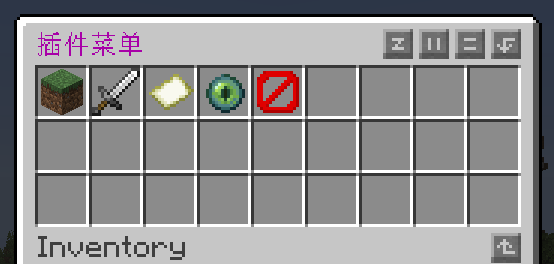

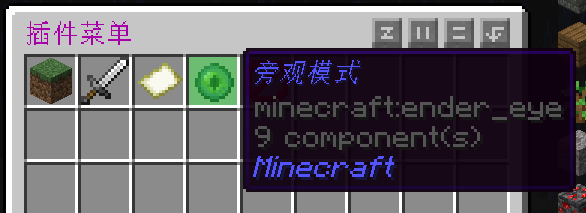

### 一个菜单的例子
我们刚才分明是在创建一个花里胡哨的箱子，它没有菜单的功能，甚至玩家还能把物品从中拿出来！别担心，通过事件监听器，我们可以实现一个真正的菜单。

```java
// at /src/main/java/top/tachibana/paperdemo/PaperdemoListener.java
package top.tachibana.paperdemo;

import org.bukkit.entity.*;
import org.bukkit.event.EventHandler;
import org.bukkit.event.Listener;
import org.bukkit.inventory.ItemStack;
import org.bukkit.inventory.Inventory;
import org.bukkit.event.inventory.InventoryClickEvent;
//import ...

public final class PaperdemoListener implements Listener {
    // ...
    @EventHandler
    public void onInventoryClick(InventoryClickEvent event){
        if(event.getClickedInventory() == Paperdemo.getMenu()){
            Inventory menu = Paperdemo.getMenu();
            HumanEntity player = event.getWhoClicked();
            event.setCancelled(true);
            ItemStack item = menu.getItem(event.getSlot());
            if(item == null){
                return;
            }
            switch (item.getType()){
                case GRASS_BLOCK -> player.setGameMode(GameMode.CREATIVE);
                case IRON_SWORD -> player.setGameMode(GameMode.SURVIVAL);
                case MAP -> player.setGameMode(GameMode.ADVENTURE);
                case ENDER_EYE -> player.setGameMode(GameMode.SPECTATOR);
                case BARRIER -> player.closeInventory();
            }
        }
    }
    // ...
}
```

我们通过监听玩家点击物品栏的物品槽来实现菜单，当玩家点击菜单的物品时，先取消这个事件（这样无论如何玩家都无法拿出物品栏的物品啦），然后通过`switch case`判断玩家的操作，最后执行对应的内容。

前四个选项都是改变玩家的游戏模式，方法`setGameMode()`我们在[玩家接口](#%E7%8E%A9%E5%AE%B6%E6%8E%A5%E5%8F%A3)已经讲过。

第五个选项是关闭当前菜单，我们通过接口`HumanEntity`的方法`closeInventory()`实现。

现在，我们完成了真正意义上的菜单，它可以很方便的改变游戏模式（能有`F3+F4`方便吗？）。

## 配方
基于Bukkit API，我们可以为游戏添加合成、熔炉、高炉、烟熏炉、锻造台、营火（~~多少人不知道营火其实也有配方~~）、切石机、交易配方。添加配方所使用到的类和方法都在包`org.bukkit.inventory`下。我们先来看最常用的合成配方。

### 合成
根据[mcwiki](https://zh.minecraft.wiki/w/%E9%85%8D%E6%96%B9#%E5%90%88%E6%88%90%E9%85%8D%E6%96%B9)的相关内容，合成配方主要分为有序配方（Shaped Recipe）和无序配方（Shapeless Recipe）。其它类型的配方难以也不建议用插件实现，本节内容只演示最常见的有序配方和无序配方。

#### 无序配方
相较于有序配方，无序配方较为简单，无序配方**不关心**物品的摆放顺序，只关心有多少个物品参与合成。例如，下界合金锭只需要四个金锭和四个下界合金碎片合成，你可以将八个材料摆成任意形状。假设我们想让一个烈焰棒和两个末影珍珠合成两个末影之眼。

为了创建一个无序合成的配方，我们只需要在主类的方法`onEnable()`添加以下代码。

```java
// 烈焰棒 + 2 * 末影珍珠 合成 2 * 末影之眼
ShapelessRecipe blazeRodToEnderEye = new ShapelessRecipe(
        new NamespacedKey(this, "blaze_rod_to_ender_eye"),
        new ItemStack(Material.ENDER_EYE, 2))
        .addIngredient(Material.BLAZE_ROD)
        .addIngredient(2, Material.ENDER_PEARL);
this.getServer().addRecipe(blazeRodToEnderEye);
```

这个代码虽然只有两行（准确来说是两条语句），但是理解起来并不简单。我们`new`了一个`ShapelessRecipe`的对象，它的构造器有两个参数，第一个参数是类`NamespacedKey`的实例（这为我们的配方创建ID，它的构造器也有两个参数，分别是插件的实例和配方的ID），第二个参数是一个`ItemStack`的实例（老面孔了，你应该熟悉吧），代表着合成后的产物。

我们调用这个类的方法`addIngredient()`添加合成配方的物品，它的参数是`Material`的枚举常量。因为原材料是一个烈焰棒和两个末影珍珠，所以我们调用了两次`addIngredient()`。注意，`addIngredient()`的返回值是你调用的对象的引用，因此我们便可以这种方式编写代码。

第二条语句我们调用了方法`addRecipe()`注册了这个配方。

<Aside type="tip">
当无序合成的原材料小于四个（也就是你能在2*2的格子内合成）时，可以无需借助工作台而使用生存模式的背包合成该物品。
</Aside>

#### 有序配方
当我们合成木镐时，一定要将木板排成一行，如果没有有序配方，工作台无法区分木镐与木斧。在这一节中我们将创建一个有序配方。

众所周知1.9之后原版无法合成附魔金苹果，我想利用插件复刻老版本的合成配方。与无序合成一样，我们需要先在主类的方法`onEnable()`创建一个配方类。

```java
// 附魔金苹果的合成配方
// | B | B | B |
// | B | A | B |
// | B | B | B |
// B: 金块
// A: 苹果
ShapedRecipe enchantedGoldenApple = new ShapedRecipe(
        new NamespacedKey(Paperdemo.getInstance(), "craft_enchanted_golden_apple"),
        new ItemStack(Material.ENCHANTED_GOLDEN_APPLE))
        .shape("BBB", "BAB", "BBB")
        .setIngredient('A', Material.APPLE)
        .setIngredient('B', Material.GOLD_BLOCK);
this.getServer().addRecipe(enchantedGoldenApple);
```

有序合成的类的构造器与无序合成的一样，在此不多赘述。如果你写过数据包，那么你一定对这种写法很熟悉。这个类的方法`shape()`的三个参数分别表示合成的形状的每一**行**，它由一些字符构成，不同的字符代表不同的材料，我们把它叫做键（key），例如在这里， *B* 代表金块（Block of Gold）， *A* 代表苹果（Apple）。方法`setIngredient()`则将不同的键与材料连接在了一起，它的两个参数分别是键（注意是`char`类型而不是`String`）和材料类型（注意是`Material`类型而不是`ItemStack`）。

<Aside type="caution">
当你的合成配方有空气时，请用空格作为键值，而不是将材料设为`Material.AIR`。
</Aside>

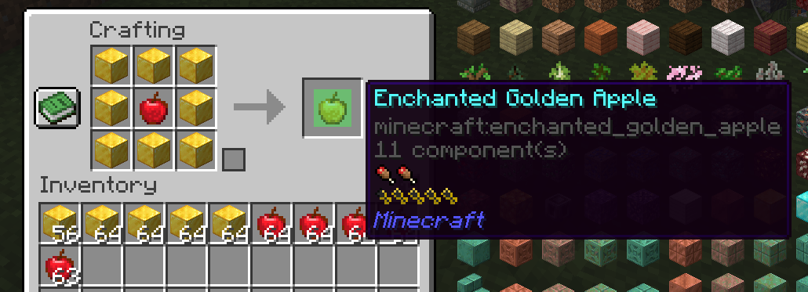

<Aside>
建议使用有意义的字符来作为不同的材料的键值，以增加代码的可读性。
</Aside>

<Aside type="tip">
当有序合成能在2*2的格子内，可以无需借助工作台而使用生存模式的背包合成该物品。
</Aside>

### 优化项目结构
将配方相关的代码直接放在方法`onEnable()`并不是一个好选择。为了提高代码的可读性，我们期望的是，有一个专门的类实现这些配方，我们仅需要在方法`onEnable()`内注册这些配方。

我们新建了一个叫做`PaperdemoRecipe`的类，它提供了一系列的静态方法，能返回这些配方的对象的列表。

```java
// at /src/main/java/top/tachibana/paperdemo/PaperdemoRecipe.java
package top.tachibana.paperdemo;

import org.bukkit.Material;
import org.bukkit.NamespacedKey;
import org.bukkit.inventory.*;

import java.util.List;

public class PaperdemoRecipe {
    public static List<ShapedRecipe> getShapedRecipe(){
        // 附魔金苹果的合成配方
        // | B | B | B |
        // | B | A | B |
        // | B | B | B |
        // B: 金块
        // A: 苹果
        ShapedRecipe enchantedGoldenApple = new ShapedRecipe(
                new NamespacedKey(Paperdemo.getInstance(), "craft_enchanted_golden_apple"),
                new ItemStack(Material.ENCHANTED_GOLDEN_APPLE))
                .shape("BBB", "BAB", "BBB")
                .setIngredient('A', Material.APPLE)
                .setIngredient('B', Material.GOLD_BLOCK);
        return List.of(
                enchantedGoldenApple
        );
    }
    public static List<ShapelessRecipe> getShapelessRecipe() {
        // 烈焰棒 + 2 * 末影珍珠 合成 2 * 末影之眼
        ShapelessRecipe blazeRodToEnderEye = new ShapelessRecipe(
                new NamespacedKey(Paperdemo.getInstance(), "blaze_rod_to_ender_eye"),
                new ItemStack(Material.ENDER_EYE, 2))
                .addIngredient(Material.BLAZE_ROD)
                .addIngredient(2, Material.ENDER_PEARL);
        return List.of(
                blazeRodToEnderEye,
        );
    }
}
```

然后在`onEnable()`中用`forEach()`作用于`getShapedRecipe()`和`getShapelessRecipe`返回的列表的每一个元素。

```java
// at /src/main/java/top/tachibana/paperdemo/Paperdemo.java
// ...
    @Override
    public void onEnable() {
        // ...
        PaperdemoRecipe.getShapedRecipe().forEach(this.getServer()::addRecipe);
        PaperdemoRecipe.getShapelessRecipe().forEach(this.getServer()::addRecipe);
        // ...
    }
// ...
```

为什么不选择直接让`PaperdemoRecipe`的静态方法返回某个配方类的实例，而是返回一个列表再使用`forEach()`遍历呢？这是因为当你以后想要为你的插件添加该种类的配方时，你便无需再次注册配方，且这种写法更加简洁。

<Aside type="tip">
方法`addRecipe()`接受`Recipe`对象，而我们所认识的所有配方类都实现了接口`Recipe`。利用这一原理，我们能不能实现方法`getAllRecipe()`，从而实现只注册一次配方呢？问题留给读者思考。
</Aside>

### 多种类的输入
部分物品合成配方的不仅仅支持一种材料类型，例如箱子，可以由任意种类的木板环绕一圈合成，难道我们需要为每种木板都创建一个配方么？其实可以借助接口`RecipeChoice`来简单地实现我们的需求。

mc中的铜块暴露在空气中会逐渐被氧化，一旦铜块被氧化，就无法像铜块那样分解成铜锭。如果我想要改变这一特性，正常来说我需要添加三种合成配方（如果算上涂蜡的话是六种）。但是借助接口`RecipeChoice`，我们只需要创建一种配方。

```java
// at /src/main/java/top/tachibana/paperdemo/PaperdemoRecipe.java
package top.tachibana.paperdemo;

import org.bukkit.Material;
import org.bukkit.NamespacedKey;
import org.bukkit.inventory.*;

import java.util.List;

public class PaperdemoRecipe {
    // ...
    public static List<ShapelessRecipe> getShapelessRecipe() {
        // ...
        // 所有类型的铜块都能分解成9 * 铜锭
        RecipeChoice.MaterialChoice choice = new RecipeChoice.MaterialChoice(
                List.of(
                        //Material.COPPER_BLOCK, 原版存在，无需添加
                        Material.EXPOSED_COPPER,
                        Material.WEATHERED_COPPER,
                        Material.OXIDIZED_COPPER)
        );
        ShapelessRecipe copperBlockToIngot = new ShapelessRecipe(
                new NamespacedKey(Paperdemo.getInstance(), "copper_block_to_ingot"),
                new ItemStack(Material.COPPER_INGOT, 9)
        ).addIngredient(choice);
        return List.of(
                blazeRodToEnderEye,
                copperBlockToIngot
        );
    }
}
```

我先创建了一个`MaterialChoice`的对象，它实现了接口`RecipeChoice`，它的构造器是一个`Material`枚举常量的列表，我们将分解成铜锭的三种氧化过了的铜块添加到这个列表中（你也可以将涂蜡的铜块也加入进去）。对于添加配方所调用的`addIngredient()`、`setIngredient()`等，基本都有对应的重载方法，能接受实现了接口`RecipeChoice`的对象，因此我们可以将`choice`当作一个`Material`的枚举常量传入。

得益于上一节我们做的努力，现在我们添加新的无序合成配方时不需要再此在方法`onEnable()`中注册了，只需要在方法`getShapelessRecipe()`返回的列表中添加新的配方对象。

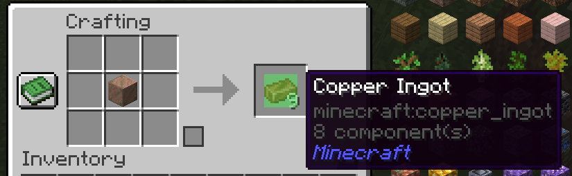

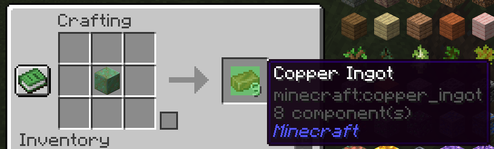

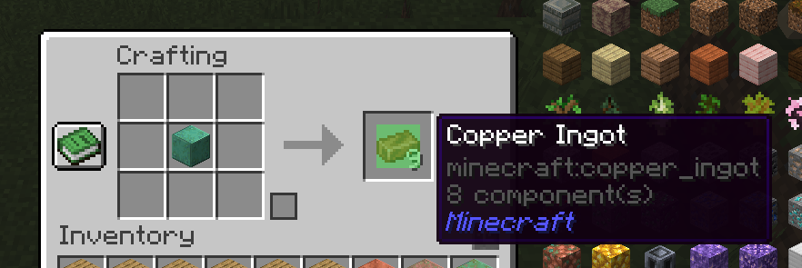

### 煅烧
本节将讲述如何添加熔炉、高炉、烟熏炉、营火、切石机的配方，前四种配方的添加方式完全一致，切石机的配方相比其它配方构造器的参数少了经验值和处理时间。它们对应的类分别是`FurnaceRecipe`、`BlastingRecipe`、`SmokingRecipe`、`CampfireRecipe`、`StonecuttingRecipe`。

下面用高炉来举例子，我们将创建一个配方，能将锁链煅烧成三个铁粒。

```java
// at /src/main/java/top/tachibana/paperdemo/PaperdemoRecipe.java
package top.tachibana.paperdemo;

import org.bukkit.Material;
import org.bukkit.NamespacedKey;
import org.bukkit.inventory.*;

import java.util.List;

public class PaperdemoRecipe {
    // ...
    public static List<BlastingRecipe> getBlastingRecipe(){
        // 铁链煅烧成 3 * 铁粒
        BlastingRecipe chainToIronNugget = new BlastingRecipe(
                new NamespacedKey(Paperdemo.getInstance(), "chain_to_iron_nugget"),
                new ItemStack(Material.IRON_NUGGET, 3),
                Material.CHAIN,
                0.2f,
                100
        );
        return List.of(
                chainToIronNugget
        );
    }
}
```

然后在方法`onEnable()`中添加这样的代码。

```java
// at /src/main/java/top/tachibana/paperdemo/Paperdemo.java
// ...
    @Override
    public void onEnable() {
        // ...
        PaperdemoRecipe.getBlastingRecipe().forEach(this.getServer()::addRecipe);
        // ...
    }
// ...
```

`BlastingRecipe`的构造器的第一个参数和第二个参数基本和之前的配方类相同，第三个参数是烧炼的原材料，是一个`Material`的枚举常量，第四个参数是烧炼一次所获得的经验值，是一个`float`类型的浮点数，第五个参数是烧炼所消耗的时间，单位是游戏刻（tick）。

值得一提的是，如果你创建的是切石机配方，即`StonecuttingRecipe`，则不需要提供烧炼获得的经验值和烧炼所需的时间。

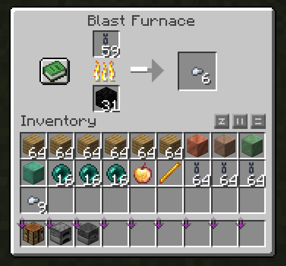

### 交易
通过实例化类`MerchantRecipe`来创建交易配方。

```java
// at /src/main/java/top/tachibana/paperdemo/PaperdemoRecipe.java
package top.tachibana.paperdemo;

import org.bukkit.Material;
import org.bukkit.NamespacedKey;
import org.bukkit.inventory.*;

import java.util.List;

public class PaperdemoRecipe {
    // ...
    public static List<MerchantRecipe> getMerchantRecipe(){
        // 2 * 绿宝石 交易钻石
        MerchantRecipe merchantDiamond = new MerchantRecipe(
                new ItemStack(Material.DIAMOND),
                10
        );
        merchantDiamond.setIngredients(List.of(new ItemStack(Material.EMERALD, 2)));
        return List.of(
                merchantDiamond
        );
    }
}
```

类`MerchantRecipe`的构造器的第一个参数是交易获取的物品，也就是村民卖的东西，第二个参数是交易的最大次数，交易达到次数后会停止交易直到村民补货。

我们通过方法`setIngredients()`设置交易的物品，这个方法的参数**长度不超过2**的类型为`List<ItemStack>`的变量。

按照之前的方式添加配方你会发现你的配方似乎不生效。这是因为不同的村民有特定的配方。为了给指定的村民添加我们的配方，我写了一个简单的事件监听器（都看到这了不会不知道事件监听器是啥吧），当玩家用钻石对着职业为工具匠的村民右键时，村民的配方将会变成我们设置的配方。

```java
// at /src/main/java/top/tachibana/paperdemo/PaperdemoListener.java
package top.tachibana.paperdemo;

import org.bukkit.Material;
import org.bukkit.entity.Villager;
import org.bukkit.event.EventHandler;
import org.bukkit.event.Listener;
import org.bukkit.event.player.PlayerInteractEntityEvent;
//import ...

public final class PaperdemoListener implements Listener {
    // ...
    @EventHandler
    public void onRightClick(PlayerInteractEntityEvent event){
        if(event.getPlayer().getInventory().getItemInMainHand().getType() == Material.DIAMOND){
            if(event.getRightClicked() instanceof Villager villager){
                if(villager.getProfession() == Villager.Profession.TOOLSMITH){
                    villager.setRecipes(PaperdemoRecipe.getMerchantRecipe());
                }
            }
        }
    }
    // ...
}
```

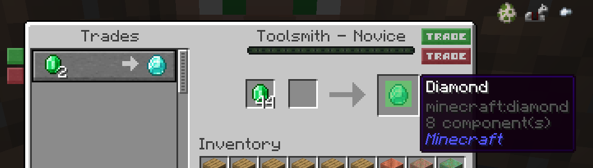

<Aside type="tip">
这种实现有一种局限性，当村民补货后，它的配方又变回了原来的配方。那么我们能不能让村民补货后仍然保持这个配方呢？问题留给读者思考。
</Aside>

### 锻造

<Aside>
本章内容仅适用于1.20+，
</Aside>

添加锻造配方用到的对象与煅烧大同小异。我们先来看对应的类的构造器的类型声明。

```java
SmithingTransformRecipe(
        NamespacedKey key, 
        ItemStack result, 
        RecipeChoice template, 
        RecipeChoice base, 
        RecipeChoice addition){
            // ...
        }
```

以及

```java
SmithingTrimRecipe(
        NamespacedKey key, 
        RecipeChoice template, 
        RecipeChoice base, 
        RecipeChoice addition){
            // ...
        }
```

前者是锻造升级配方，也叫锻造转化（Smithing Transform）配方；后者是盔甲纹饰（Smithing Trim）配方。

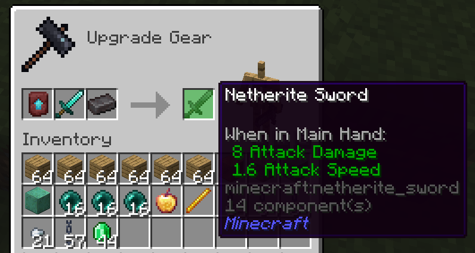

以上图为例，形式参数`key`是配方的ID，`template`即为下界升级模板的槽位，`base`即为钻石剑的槽位，`addition`即为下界合金锭的槽位，`result`即为下界合金剑的槽位，这在盔甲纹饰配方中不可用。值得注意的是，除了`key`的类型是`NamespacedKey`和`result`的类型是`ItemStack`以外，其余形式参数的类型均为`RecipeChoice`，该接口在[之前](#%E5%A4%9A%E7%A7%8D%E7%B1%BB%E7%9A%84%E8%BE%93%E5%85%A5)已介绍过。

按照之前说明过的添加其它配方的方式来添加锻造配方即可。记得要注册配方。

## 任务调度

### 游戏刻
什么是刻？以下是[mcwiki](https://zh.minecraft.wiki/w/%E5%88%BB)对刻的解释。

> 几乎所有的游戏（包括Minecraft）都由一个大的程序循环驱动，游戏内的计算遵照循环执行，按照固定的顺序依次被调用。当程序执行了一次循环，这个程序就进行了一次滴答（Tick），而计量滴答次数的单位就是刻（Tick）。在大多数情况下，刻不仅可以代表滴答的次数，也可以代表滴答本身。

如无特殊情况，本篇文章的刻均指**游戏刻**，即游戏主进程的每一次循环。在mc中除了游戏刻以外，还有红石刻的概念，在此我们不会讨论。一般地，我们有

$$
1 tick = 50 milliseconds
$$

$$
20 ticks = 1 second
$$

**TPS**（即Ticks per Second）的意思是每秒钟游戏运行多少刻，一般是20；**MSPT**（即Milliseconds per Tick）的意思是每一刻需要运行多长时间，一般为50。

在游戏中我们可以按 <kbd>F3</kbd> + <kbd>2</kbd> 查看当前的TPS。

### 创建一个任务
在我们编写插件的时候，可能会设计复杂的运行逻辑，可能有些代码并不会在事件触发后立即执行，又或者有些代码运行速度较慢，不宜占用游戏主线程。包`org.bukkit.scheduler`提供了多样的类和方法，能实现以上的需求。

#### 通过BukkitRunnable
类`BukkitRunnable`实现了Java接口`Runnable`但没实现方法`run()`，因此实例化该类必须实现方法`run()`。

```java
// at /src/main/java/top/tachibana/paperdemo/PaperdemoListener.java
package top.tachibana.paperdemo;

import org.bukkit.Material;
import org.bukkit.event.EventHandler;
import org.bukkit.event.Listener;
import org.bukkit.event.player.PlayerDropItemEvent;
import org.bukkit.scheduler.BukkitRunnable;
//import ...

public final class PaperdemoListener implements Listener {
    // ...
    @EventHandler
    public void onDropItem(PlayerDropItemEvent event){
        // 当玩家丢出下界合金锭 输出消息并延迟两秒杀死该玩家 随后取消事件
        if(event.getItemDrop().getItemStack().getType() == Material.NETHERITE_INGOT){
            new BukkitRunnable(){
                public void run(){
                    event.getPlayer().sendMessage(Component.text("如此宝贵，你竟敢随意丢弃！", NamedTextColor.YELLOW));
                    event.getPlayer().sendMessage(Component.text("你将会获得惩罚", NamedTextColor.RED));
                    try {
                        Thread.sleep(2000);
                    } catch (InterruptedException e) {
                        throw new RuntimeException(e);
                    }
                    event.getPlayer().setHealth(0);
                }
            }.runTask(Paperdemo.getInstance());
            event.setCancelled(true);
        }
    }
    // ...
}
```

我们实例化了一个继承了类`BukkitRunnable`的匿名类，并实现了方法`run()`。我们没有把这个对象赋值给某一个变量，而是直接调用了其方法`runTask()`，这样游戏便会运行这个任务。

构建后重载插件，玩家便无法丢出下界合金锭（投掷器不受影响），并且会在2s后被杀死。

#### 通过BukkitScheduler
另一种写法是使用`BukkitScheduler.runTask()`。

```java
// at /src/main/java/top/tachibana/paperdemo/PaperdemoListener.java
package top.tachibana.paperdemo;

import org.bukkit.Material;
import org.bukkit.event.EventHandler;
import org.bukkit.event.Listener;
import org.bukkit.event.player.PlayerDropItemEvent;
import org.bukkit.scheduler.BukkitScheduler;
//import ...

public final class PaperdemoListener implements Listener {
    // ...
    @EventHandler
    public void onDropItem(PlayerDropItemEvent event){
        // 当玩家丢出下界合金锭 输出消息并延迟两秒杀死该玩家 随后取消事件
        if(event.getItemDrop().getItemStack().getType() == Material.NETHERITE_INGOT){
            BukkitScheduler scheduler = Paperdemo.getInstance().getServer().getScheduler();
            scheduler.runTask(Paperdemo.getInstance(), () -> {
                    event.getPlayer().sendMessage(Component.text("如此宝贵，你竟敢随意丢弃！", NamedTextColor.YELLOW));
                    event.getPlayer().sendMessage(Component.text("你将会获得惩罚", NamedTextColor.RED));
                    try {
                        Thread.sleep(2000);
                    } catch (InterruptedException e) {
                        throw new RuntimeException(e);
                    }
                    event.getPlayer().setHealth(0);
            });
            event.setCancelled(true);
        }
    }
    // ...
}
```

先通过`server`对象的成员方法`getScheduler()`获得`BukkitScheduler`实例，再运行它的成员方法`runTask()`。注意方法`runTask()`有两个参数，分别是插件的实例和一个`Runnable`对象（也可以是`Consumer<? super BukkitTask>`对象），这里为了代码的简洁性我选择了Lambda表达式，你也可以使用`Runnable`对象（就像上一节中那个匿名类的实例），不过这么做似乎有点蠢蠢的。

### 异步执行任务
刚刚的代码有一个问题，就是在线程睡眠2s的时候整个游戏也睡眠了2s（你可以使用高频红石看看是否是这种情况）。这是我们插件开发者不愿看到的——看似是对触发事件的玩家的惩罚，实际上是对全服务器的人的惩罚。这是因为当我们调用`runTask()`的时候，相关的代码会在整个游戏的主线程中运行，方法`Thread.sleep()`便让游戏暂停运行了2s。解决方式其实很简单，只需要把方法`runTask()`改用`runTaskAsynchronously()`即可。

```java
// at /src/main/java/top/tachibana/paperdemo/PaperdemoListener.java
package top.tachibana.paperdemo;

import org.bukkit.Material;
import org.bukkit.event.EventHandler;
import org.bukkit.event.Listener;
import org.bukkit.event.player.PlayerDropItemEvent;
import org.bukkit.scheduler.BukkitScheduler;
//import ...

public final class PaperdemoListener implements Listener {
    // ...
    @EventHandler
    public void onDropItem(PlayerDropItemEvent event){
        // 当玩家丢出下界合金锭 输出消息并延迟两秒杀死该玩家 随后取消事件
        if(event.getItemDrop().getItemStack().getType() == Material.NETHERITE_INGOT){
            BukkitScheduler scheduler = Paperdemo.getInstance().getServer().getScheduler();
            scheduler.runTaskAsynchronously(Paperdemo.getInstance(), () -> {
                    event.getPlayer().sendMessage(Component.text("如此宝贵，你竟敢随意丢弃！", NamedTextColor.YELLOW));
                    event.getPlayer().sendMessage(Component.text("你将会获得惩罚", NamedTextColor.RED));
                    try {
                        Thread.sleep(2000);
                    } catch (InterruptedException e) {
                        throw new RuntimeException(e);
                    }
                    event.getPlayer().setHealth(0);
            });
            event.setCancelled(true);
        }
    }
    // ...
}
```

使用方法`runTaskAsynchronously()`，任务将会以异步的方式执行，即，任务将会在主线程以外的另一个线程运行，当玩家丢出下界合金锭的时候，游戏也不会暂停了。

<Aside>
若你的任务涉及从硬盘中读取数据、从网络中获取资源等耗时较长的动作，请**务必**使用异步的方式执行任务。
</Aside>

然而，刚刚的示例也有一点问题。每当事件触发任务被执行时，服务器后台总会发送以下的警告。

```log
[23:09:14] [Craft Scheduler Thread - 5 - paperdemo/WARN]: [DemoPlugin] Plugin paperdemo v1.0-SNAPSHOT generated an exception while executing task 12
java.lang.IllegalStateException: PlayerDeathEvent may only be triggered synchronously.
	at io.papermc.paper.plugin.manager.PaperEventManager.callEvent(PaperEventManager.java:42) ~[paper-1.21.4.jar:1.21.4-130-a392d47]
	at io.papermc.paper.plugin.manager.PaperPluginManagerImpl.callEvent(PaperPluginManagerImpl.java:131) ~[paper-1.21.4.jar:1.21.4-130-a392d47]
	at org.bukkit.plugin.SimplePluginManager.callEvent(SimplePluginManager.java:628) ~[paper-api-1.21.4-R0.1-SNAPSHOT.jar:?]
	at org.bukkit.craftbukkit.event.CraftEventFactory.callPlayerDeathEvent(CraftEventFactory.java:1028) ~[paper-1.21.4.jar:1.21.4-130-a392d47]
	at net.minecraft.server.level.ServerPlayer.die(ServerPlayer.java:1088) ~[paper-1.21.4.jar:1.21.4-130-a392d47]
	at org.bukkit.craftbukkit.entity.CraftLivingEntity.setHealth(CraftLivingEntity.java:127) ~[paper-1.21.4.jar:1.21.4-130-a392d47]
	at paperdemo-1.0-SNAPSHOT.jar/top.tachibana.paperdemo.PaperdemoListener.lambda$onDropItem$0(PaperdemoListener.java:45) ~[paperdemo-1.0-SNAPSHOT.jar:?]
	at org.bukkit.craftbukkit.scheduler.CraftTask.run(CraftTask.java:78) ~[paper-1.21.4.jar:1.21.4-130-a392d47]
	at org.bukkit.craftbukkit.scheduler.CraftAsyncTask.run(CraftAsyncTask.java:57) ~[paper-1.21.4.jar:1.21.4-130-a392d47]
	at com.destroystokyo.paper.ServerSchedulerReportingWrapper.run(ServerSchedulerReportingWrapper.java:22) ~[paper-1.21.4.jar:?]
	at java.base/java.util.concurrent.ThreadPoolExecutor.runWorker(ThreadPoolExecutor.java:1144) ~[?:?]
	at java.base/java.util.concurrent.ThreadPoolExecutor$Worker.run(ThreadPoolExecutor.java:642) ~[?:?]
	at java.base/java.lang.Thread.run(Thread.java:1570) ~[?:?]
```

这表明，事件`PlayerDeathEvent`不能异步触发。我们查阅Bukkit API的[相关文档](https://hub.spigotmc.org/javadocs/spigot/org/bukkit/scheduler/BukkitScheduler.html)可以找到这么一句话。

> Asynchronous tasks should never access any API in Bukkit. Great care should be taken to assure the thread-safety of asynchronous tasks.

我们可以换一种方式实现这种效果。

### 延迟执行任务

将代码改写成：

```java
// at /src/main/java/top/tachibana/paperdemo/PaperdemoListener.java
package top.tachibana.paperdemo;

import org.bukkit.Material;
import org.bukkit.event.EventHandler;
import org.bukkit.event.Listener;
import org.bukkit.event.player.PlayerDropItemEvent;
import org.bukkit.scheduler.BukkitScheduler;
//import ...

public final class PaperdemoListener implements Listener {
    // ...
    @EventHandler
    public void onDropItem(PlayerDropItemEvent event){
        // 当玩家丢出下界合金锭 输出消息并延迟两秒杀死该玩家 随后取消事件
        if(event.getItemDrop().getItemStack().getType() == Material.NETHERITE_INGOT){
            BukkitScheduler scheduler = Paperdemo.getInstance().getServer().getScheduler();
            event.getPlayer().sendMessage(Component.text("如此宝贵，你竟敢随意丢弃！", NamedTextColor.YELLOW));
            event.getPlayer().sendMessage(Component.text("你将会获得惩罚", NamedTextColor.RED));
            scheduler.runTaskLater(Paperdemo.getInstance(), () -> {
                    event.getPlayer().setHealth(0);
            }, 40);
            event.setCancelled(true);
        }
    }
    // ...
}
```

我们同样可以实现这样的效果，并且不会异步地触发事件`PlayerDeathEvent`。我们使用了`BukkitScheduler`的示例的方法`runTaskLater()`，与`runTask()`和`runTaskAsynchronously()`相比，`runTaskLater()`多了一个参数，即延迟的事件，单位是游戏刻。

同理，也有方法`runTaskLaterAsynchronously()`可以使用。

<Aside type="tip">
40 ticks并不一定等于2s。考虑到服务器可能调整了每秒的最大刻数量或者卡顿的情况，40 ticks可能会小于或大于2s。
</Aside>

### 周期执行任务
`BukkitScheduler`提供了方法`runTaskTimer()`，可以定期执行任务。或者你可以用`BukkitRunnable`的示例的方法`runTaskTimer()`。

```java
// at /src/main/java/top/tachibana/paperdemo/PaperdemoListener.java
package top.tachibana.paperdemo;

import org.bukkit.Material;
import org.bukkit.event.EventHandler;
import org.bukkit.event.Listener;
import org.bukkit.event.player.*;
import org.bukkit.scheduler.BukkitScheduler;
//import ...

public final class PaperdemoListener implements Listener {
    // ...
    @EventHandler
    public void onMove(PlayerMoveEvent event){
        BukkitRunnable damage = new BukkitRunnable(){
            public void run(){
                event.getPlayer().damage(0.5);
                if(event.getPlayer().getLocation().clone().add(0, -1, 0).getBlock().getType() != Material.BLUE_ICE){
                    this.cancel();
                }
            }
        };
        if(event.getTo().clone().add(0, -1, 0).getBlock().getType() == Material.BLUE_ICE){
            damage.runTaskTimer(Paperdemo.getInstance(), 0, 20);
        }
    }
    // ...
}
```

通过`runTaskTimer()`，我们可以让站在蓝冰上的玩家持续受到伤害。该方法的前两个参数分别是插件实例和延迟，延迟与`runTaskLater()`一样单位是游戏刻，最后一个参数是执行的周期，单位同样是游戏刻。

同样地，`runTaskTimer()`也有异步版本`runTaskTimerAsynchronously()`。

<Aside type="tip">
示例插件会重复执行`runTaskTimer()`，尽管有时该任务已被执行。你能想到优化的方式吗？问题留给读者思考。
</Aside>

## 配置

### 关于YAML
什么是YAML？以下介绍来自于[维基百科](https://zh.wikipedia.org/wiki/YAML)

> YAML是一个可读性高，用来表达数据序列化的格式。YAML参考了其他多种语言，包括：C语言、Python、Perl，并从XML、电子邮件的数据格式中获得灵感。目前已经有数种编程语言或脚本语言支持（或者说解析）这种语言。
>
> YAML是"YAML Ain't a Markup Language"（YAML不是一种标记语言）的递归缩写。在开发的这种语言时，YAML的意思其实是："Yet Another Markup Language"（仍是一种标记语言），但为了强调这种语言以数据为中心，而不是以标记语言为重点，而用反向缩略语重命名。

总而言之，YAML并不是一种编程语言，而是类似于HTML的标记语言。YAML对应的文件拓展名是`yml`，通常被用来存储一些数据。`Bukkit API`提供了一些API支持插件通过YAML来储存和使用它们的配置。本章内容将介绍如何使用它们。

### 创建config.yml
我们在`resources`文件夹下创建一个`config.yml`

```yml
# at /src/main/resources/config.yml
words:
  word1: "hello"
  word2: "Futaba"
num: 114514
```

这是我们插件的默认配置文件，当插件目录（`plugins`目录下以插件名字为名的文件夹）下没有`config.yml`时，将会将这个文件拷贝到插件目录下。当然，这个行为插件加载器并不会自己进行，我们要在`onEnable()`中执行以下代码来完成插件文件的拷贝。

```java
// at /src/main/java/top/tachibana/paperdemo/Paperdemo.java
package top.tachibana.paperdemo;

import org.bukkit.plugin.java.JavaPlugin;

public final class Paperdemo extends JavaPlugin {
    // ...
    @Override
    public void onEnable() {
        // ...
        // 插件配置
        this.saveDefaultConfig();
    }
    // ...
}
```

这样，当我们重载插件后，`config.yml`会自动生成，且内容与我们放在`resources`文件夹下的一致。

<Aside type="danger">
加载资源文件时一定要保证`resources`文件夹下有对应的资源文件。
</Aside>

### 加载和获取config.yml
为了节省代码量，我们创建一个新类，获取配置文件的字段，然后提供这些字段的getter。

```java
// at /src/main/java/top/tachibana/paperdemo/Config.java
package top.tachibana.paperdemo;

import org.bukkit.configuration.InvalidConfigurationException;
import org.bukkit.configuration.file.FileConfiguration;

import java.io.File;
import java.io.IOException;

public class Config {
    private static FileConfiguration config = Paperdemo.getInstance().getConfig();
    private static int num = config.getInt("num");
    private static String str1 = config.getString("words.word1");
    private static String str2 = config.getString("words.word2");
    public static void reload(){
        File file = new File(Paperdemo.getInstance().getDataFolder(), "config.yml");
        try {
            config.load(file);
        } catch (IOException | InvalidConfigurationException e) {
            throw new RuntimeException(e);
        }
        Config.num = config.getInt("num");
        Config.str1 = config.getString("words.word1");
        Config.str2 = config.getString("words.word2");
    }
    public static int getNum() {
        return num;
    }
    public static String getStr1() {
        return str1;
    }
    public static String getStr2() {
        return str2;
    }
}
```

别看代码量很多，其实大多都是声明变量和定义方法。

`config`的类型是`FileConfiguration`，这个对象储存了配置文件，我们可以通过`config`的成员方法获取和修改配置。通过`config()`的成员方法`getInt`和`getString`，我们获取到了`num`，`str1`和`str2`。

静态方法`reload()`用于重新加载配置文件，在这里我们使用了`config`的成员方法`load()`，它接受一个`File`或`Reader`对象，用于指定读取的文件。

再写一个简单的指令获取方法的内容。

```java
// at /src/main/java/top/tachibana/paperdemo/ConfigCommand.java
package top.tachibana.paperdemo;

import net.kyori.adventure.text.Component;
import org.bukkit.command.Command;
import org.bukkit.command.CommandExecutor;
import org.bukkit.command.CommandSender;
import org.bukkit.command.TabCompleter;
import org.jetbrains.annotations.NotNull;
import org.jetbrains.annotations.Nullable;

import java.util.List;
import java.util.stream.Collectors;

public class ConfigCommand implements CommandExecutor, TabCompleter {
    private final List<String> ARGS = List.of("reload", "num", "str1", "str2");
    @Override
    public boolean onCommand(
            @NotNull CommandSender sender,
            @NotNull Command command,
            @NotNull String label,
            @NotNull String[] args){
        if(args.length == 0){
            sender.sendMessage(Component.text("不是这样用的"));
            return true;
        }
        switch (args[0]){
            case "reload":
                Config.reload();
                sender.sendMessage(Component.text("已成功重载插件"));
                break;
            case "num":
                sender.sendMessage(Component.text("num的值是" + Config.getNum()));
                break;
            case "str1":
                sender.sendMessage(Component.text("str1的值是" + Config.getStr1()));
                break;
            case "str2":
                sender.sendMessage(Component.text("str2的值是" + Config.getStr2()));
                break;
            default:
                sender.sendMessage(Component.text("不是这样用的"));
                break;
        }
        return true;
    }
    @Override
    public @Nullable List<String> onTabComplete(
            @NotNull CommandSender sender,
            @NotNull Command command,
            @NotNull String label,
            @NotNull String[] args){
        if(args.length == 1) {
            if (args[0].isEmpty()) return ARGS;
            else return ARGS.stream().filter(s -> s.startsWith(args[0])).collect(Collectors.toList());
        }
        return null;
    }
}
```

效果如下：


### 多文件配置
许多知名插件都不止一个配置文件，例如*EssentialsX*，*Residence*。我们能不能让我们的插件能从`custom.yml`中读取文件，做到我们读取`config.yml`那样呢？当然可以。

我们现在`resources`文件夹下创建一个`custom.yml`。

```yml
# at /src/main/resources/custom.yml

```

它现在没有东西，后续我将会演示修改它。

现在，让我们在主类中写下这样的代码。

```java
// at /src/main/java/top/tachibana/paperdemo/Paperdemo.java
package top.tachibana.paperdemo;

import org.bukkit.plugin.java.JavaPlugin;

import java.io.File;

public final class Paperdemo extends JavaPlugin {
    private static FileConfiguration custom;
    // ...
    @Override
    public void onEnable() {
        // ...
        // 插件配置
        this.saveDefaultConfig();
        this.saveResource("custom.yml", false);
        File file = new File(this.getDataFolder(), "custom.yml");
        Paperdemo.custom = YamlConfiguration.loadConfiguration(file);
    }
    // ...
    public static FileConfiguration getCustom(){
        return Paperdemo.custom;
    }
}
```

方法`saveResource()`用于将文件夹`resources`下的任意文件内容拷贝到插件目录下，第一个参数是文件的名字，第二个参数是是否启用覆盖，如果是，则每次启动插件时文件内容都会被重置。

之后，我们尝试从文件中加载自定义的配置文件。插件实例的成员方法`getDataFolder()`用于获取插件目录。`YamlConfiguration`的静态方法`loadConfiguration()`用于加载插件，返回一个`FileConfiguration`的实例。我们设置了`custom`的getter，这可以让我们日后获取`custom.yml`的内容。

### 修改配置文件
接下来我将演示如何修改配置文件并存储至原配置文件中。这在用户填写一些无效的字段时可以使配置文件的字段重新合法，也可以实现在游戏中修改配置，并将其保存至配置文件中以便下次使用。

```java
// at /src/main/java/top/tachibana/paperdemo/Paperdemo.java
package top.tachibana.paperdemo;

import org.bukkit.plugin.java.JavaPlugin;

import java.io.File;
import java.io.IOException;

public final class Paperdemo extends JavaPlugin {
    private static FileConfiguration custom;
    // ...
    public static void saveCustom() throws IOException {
        File file = new File(Paperdemo.getInstance().getDataFolder(), "custom.yml");
        Paperdemo.custom.save(file);
    }
}
```

```java
// at /src/main/java/top/tachibana/paperdemo/ConfigCommand.java
package top.tachibana.paperdemo;

import net.kyori.adventure.text.Component;
import org.bukkit.command.Command;
import org.bukkit.command.CommandExecutor;
import org.bukkit.command.CommandSender;
import org.bukkit.command.TabCompleter;
import org.jetbrains.annotations.NotNull;
import org.jetbrains.annotations.Nullable;

import java.util.List;
import java.util.stream.Collectors;

public class ConfigCommand implements CommandExecutor, TabCompleter {
    private final List<String> ARGS = List.of("reload", "edit", "save", "num", "str1", "str2");
    @Override
    public boolean onCommand(
            @NotNull CommandSender sender,
            @NotNull Command command,
            @NotNull String label,
            @NotNull String[] args){
        if(args.length == 0){
            sender.sendMessage(Component.text("不是这样用的"));
            return true;
        }
        switch (args[0]){
            case "edit":
                if(args.length == 1 || args.length == 2){
                    sender.sendMessage(Component.text("不是这样用的"));
                    return true;
                }
                else{
                    Paperdemo.getCustom().set(args[1], args[2]);
                    sender.sendMessage(Component.text("已将 " + args[1] + " 设置为 " + args[2]));
                }
                break;
            case "save":
                try {
                    Paperdemo.saveCustom();
                    sender.sendMessage(Component.text("已保存"));
                } catch (IOException e) {
                    sender.sendMessage(Component.text("保存失败"));
                }
                break;
            // ...
            default:
                sender.sendMessage(Component.text("不是这样用的"));
                break;
        }
        return true;
    }
    // ...
}
```

自定义方法`saveCustom`用于保存配置文件。`FileConfiguration`的实例`custom`的成员方法`save()`用于保存配置至指定的路径，它的参数是一个`File`的实例。

`custom`的成员方法`set()`可以设置指定字段的值。第一个参数是`String`类型的变量，表示`key`，第二个参数是`Object`类型的变量（可以是`String`、`int`或其它类型）。

效果如下：


## 杂项
感谢你能看到这里！本章的内容较为琐碎，你可以按照需求进行学习。

### 如何获取插件实例
在编写插件时，有时候需要获取插件实例的引用（就是在主类的方法`onEnable()`反复调用的`this`），下面介绍两种方式获取插件实例的引用。

#### 通过private static成员字段
这是本插件的做法。因为插件主类只会实例化一次，因此我们可以通过一个static的对象存储唯一实例的引用，然后通过方法`onEnable()`初始化。
```java
// at /src/main/java/top/tachibana/paperdemo/Paperdemo.java
package top.tachibana.paperdemo;

import org.bukkit.plugin.java.JavaPlugin;

public final class Paperdemo extends JavaPlugin {
    private static Paperdemo instance;
    public static Paperdemo getInstance(){
        return Paperdemo.instance;
    }
    @Override
    public void onEnable() {
        instance = this;
    }
}
```

#### 通过PluginManager
使用接口`PluginManager`（我们在注册事件监听器时曾经用过）不但可以获取到自己的插件的实例，还可以获取到别的插件的实例（前提是已加载）。`getPlugin()`的唯一参数时一个字符串，表示插件的名字。

```java
// at /src/main/java/top/tachibana/paperdemo/Paperdemo.java
package top.tachibana.paperdemo;

import org.bukkit.plugin.java.JavaPlugin;

public final class Paperdemo extends JavaPlugin {
    public static Paperdemo getInstance(){
        //也可以这么写
        return (Paperdemo)Bukkit.getPluginManager().getPlugin("Paperdemo");
    }
}
```

### 一些有用的外部网站
这些网站可能对你学习插件编写有帮助，建议收藏。

- [本项目的github仓库](https://github.com/FutabaTachibana/paperdemo)
- [Bukkit API（spigotmc.org提供）](https://hub.spigotmc.org/javadocs/spigot/)
- [Bukkit API（papermc.io提供，多了Paper的专属API）](https://jd.papermc.io/paper/1.21.4/)
- [Paper官方文档](https://docs.papermc.io/paper)
- [Minecraft Wiki](https://zh.minecraft.wiki/)
- [Minecraft Development插件](https://plugins.jetbrains.com/plugin/8327-minecraft-development)
