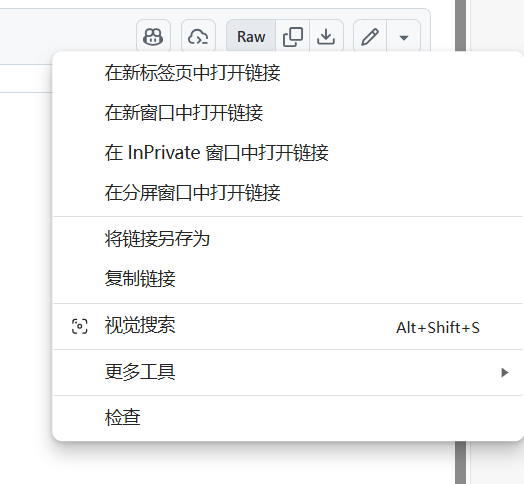

import { Aside } from 'astro-pure/user'

## 前言
~~心系玩家的~~腐竹发现，用小游戏或者地图存档开服的时候，经常需要安装地图作者指定的资源包（仅安装在客户端的资源包一般是材质包，下文都称之为资源包）。对于部分玩家来说，安装资源包轻而易举，但是有些玩家可能觉得麻烦。

既然资源包可以在游戏启动后甚至是进入世界后加载，如果能实现进入服务器的时候，服务器告诉客户端应该去哪里下载资源包，然后客户端下载好自动安装，那不是很方便吗？

幸运的是，不需要任何模组和插件，你就可以实现这个效果。

## 了解配置文件
你一定知道Minecraft服务器有个叫做`server.properties`的文件，仔细观察（别真观察了，直接使用`Ctrl+F`或者`Command+F`查找关键字*res*吧）这个配置文件，你会发现有四个（实际上是五个）跟资源包有关的键，接下来我会讲解如何正确填写这四个键的值。

```properties title='server.properties'
require-resource-pack=false
resource-pack=
resource-pack-id=
resource-pack-prompt=
resource-pack-sha1=
```

- `require-resource-pack`的值仅能为布尔类型的，表示是否强制玩家下载这个资源包，其实就算你设置成`true`，玩家在下载资源包失败的情况下也能进入游戏。
- `resource-pack`的值是资源包的 URI ，但是我试过了，不能使用`file://`之类的链接来指向服务器本地的一个文件，疑似只能使用HTTP和HTTPS。
- `resource-pack-id`，一般来说服务器资源包的 UUID 值都是随机的，用于客户端标识资源包，但是你也可以通过这个键指定设置一个资源包的 UUID ，自动生成和指定 UUID 没有多少区别，所以我不建议你修改这个键的值。
- `resource-pack-prompt`的值为首次进入服务器向玩家提示的内容，格式为[原始JSON文本](https://zh.minecraft.wiki/w/%E6%96%87%E6%9C%AC%E7%BB%84%E4%BB%B6?variant=zh-cn)。
- `resource-pack-sha1`，资源包的 SHA-1 值，必须为小写的十六进制数字。

## 让服务器为客户端提供资源包
将`require-resource-pack`设置为`true`即可。

## 为资源包指定 URI 
`resource-pack`的值是资源包的 URI ，这个资源包是需要提供在互联网上供人下载的，我们可以通过以下几种方式创建资源包的 URI 。

### 使用地图作者直接提供的链接
假设地图作者将客户端资源包单独发布，可以把 TA 提供的链接直接用作这个资源包的 URI 。

如果客户端资源包和地图一起打包发布，或者这个作者使用了~~万恶的~~百度网盘、夸克网盘之类的东西，那就不能用这个方法了。

### 使用 Nginx 
配置文件如下
```nginx title='nginx.conf'
server {
    # 如果使用 HTTPS ，这里应该监听443端口然后提供 SSL 证书
    listen 80;
    server_name files.example.com;

    location / {
        alias /var/files/;

        # 防止用户以../访问文件
        if ($request_uri ~* (\.\.|%2e%2e|%u002e%u002e)) {
            return 403;
        }
        # 配置黑名单
        location ~ /\. {
            return 403;
        }
        location ~ ^/.*\.(bak|conf|sql)$ {
            return 403;
        }

        # 以下配置内容都跟浏览器相关，不配置也不影响客户端下载资源包
        autoindex on;
        autoindex_exact_size off;
        autoindex_localtime on;
        location ~* \.(html)$ {
            add_header Content-Disposition "inline";
        }
        location ~* \.(!html)$ {
            # 强制浏览器下载
            add_header Content-Disposition "attachment"; 
        }
    }
}
```

然后将你要提供的资源包（例如`example.zip`）放在`/var/files`下面，使用`http://files.example.com/example.zip`作为这个资源包的 URI 链接。

`/var/files`可以改成其它的路径。

### 使用 Github 
先创建一个 Github 仓库，注意将仓库设置为 **public** ，上传你要提供的资源包文件在这个仓库里，然后点击这个文件，因为`zip`是一个二进制文件，这里不会预览它的内容，右键内容页右上角的 **Raw** ，点击**复制链接**。



你将会得到形如`https://github.com/f0xea/resourcepack/raw/refs/heads/main/example.zip`的链接，这就是资源包的URI。

<Aside>
部分网络不好的玩家可能无法直接访问 Github 。
</Aside>

### 使用网盘
如果某个网盘提供了直链下载功能，那么你可以自己将文件上传到这个网盘上，并将直链用作这个资源包的 URI 。

## 为资源包设置 SHA-1 值
为了保障安全，应该为`resource-pack-sha1`提供资源包的 SHA-1 值。尽管该内容留空也没影响，但我还是推荐将这里填上资源包的 SHA-1 值。

计算文件的 SHA-1 值不会占用太多时间，仅仅需要使用`sha1sum`命令。

```bash
futaba@Tachibana:~$ sha1sum example.zip
68e691bfe6329c9f6f61748b0f17a7e197bc6a51  example.zip
```

将输出结果的前面这一串十六进制数字（不是我这里的一串数字，不同文件的 SHA-1 值不一样）填入`resource-pack-sha1`即可。

## 常见问题
### Q: 客户端无法下载资源包
资源包下载是客户端的行为，其内容会记录在客户端的 log 中，请让玩家发送客户端日志以解决问题。

### Q: 使用 Nginx 解析 URI 始终无法访问
如果你的服务器位于中国大陆，请先进行备案，否则无法使用服务器的 80 和 443 端口。

你也可以不通过 80 端口使用 HTTP 传输资源包（但是无法使用 HTTPS 协议）。

<Aside type="danger">
在中国大陆提供网络服务必须严格遵守相关法律法规。

禁止使用该技术在互联网上提供非法内容。
</Aside>

## 相关网站
[Minecraft Wiki: 服务端配置文件格式](https://zh.minecraft.wiki/w/%E6%9C%8D%E5%8A%A1%E7%AB%AF%E9%85%8D%E7%BD%AE%E6%96%87%E4%BB%B6%E6%A0%BC%E5%BC%8F#Java%E7%89%88_3)

[Minecraft Wiki: 文本组件](https://zh.minecraft.wiki/w/%E6%96%87%E6%9C%AC%E7%BB%84%E4%BB%B6)

[Nginx](https://nginx.org/)

[Github](https://github.com/)